# 🏢 AgenticDev: Autonomous AI Software Company Framework

> An **SEO-optimized, production-ready autonomous multi-agent software engineering company** built for [Google Antigravity (AGY)](https://antigravity.dev).
> Drop this .agents/ folder into any workspace to instantly deploy **49 specialized AI software engineers**, **22 rich skill guides**, and **6 automated workflows**. Build, test, and release real software with an autonomous AI developer team.

[](#-agent-roster)
[](#-skills-library)
[](#-workflows)
[](.agents/registry/agent-registry.json)
[](./LICENSE)

---

## 📋 Table of Contents

- [What's New in v3.0.0](#-whats-new-in-v300)
- [Architecture Overview](#-architecture-overview)
- [Project Type Routing](#-project-type-routing)
- [Phase Gate System](#-phase-gate-system)
- [Adaptable Pipeline](#-adaptable-pipeline)
- [Rate Limiting, Caching & Stress Testing](#-rate-limiting-caching--stress-testing)
- [Agent Roster](#-agent-roster)
- [Skills Library](#-skills-library)
- [Workflows](#-workflows)
- [Quick Start](#-quick-start)
- [Contributing](#-contributing)

---

## 🎉 What's New in v3.0.0

- **Merged `project-manager`**: Now the single smart orchestrator that auto-detects project type.
- **`technical-architect`**: Now interviews the user before designing architecture to gather comprehensive requirements.
- **UX Gate**: `uiux-lead` is now a hard prerequisite gate before any frontend implementation begins.
- **New AI/ML Department**: `ai-ml-lead` + 3 specialized workers (`rag-pipeline-worker`, `llm-config-worker`, `vector-db-worker`) for AI/RAG projects.
- **New Testing Gate**: `stress-test-worker` for production load testing and rate limit validation.
- **New Automation Capability**: `automation-workflow-worker` for n8n/automation projects.
- **2 New Workflows**: `ai-rag-project`, `automation-workflow`.
- **2 New Skills**: `load-testing`, `ai-ml-engineering`.
- **Performance Built-in**: Rate limiting + caching are now built directly into the architecture and backend skill guides.

---

## 🏛️ Architecture Overview

The multi-agent system structure mirrors a real company.

```mermaid
flowchart TD
    PM[project-manager] --> TA[technical-architect]
    PM --> UI[uiux-lead]
    PM --> FE[frontend-lead]
    PM --> BE[backend-lead]
    PM --> DL[data-lead]
    PM --> ML[mobile-lead]
    PM --> AI[ai-ml-lead]
    PM --> SEC[security-lead]
    PM --> QA[qa-lead]
    PM --> DEV[devops-release-lead]
    PM --> IM[integration-manager]
    PM --> DOC[documentation-agent]

    UI --> U1[mockup-wireframe-worker]
    
    FE --> F1[ui-component-worker]
    FE --> F2[routing-worker]
    FE --> F3[state-management-worker]
    FE --> F4[api-integration-worker]
    FE --> F5[frontend-test-worker]
    FE --> F6[accessibility-worker]
    FE --> F7[performance-worker]
    FE --> F8[localization-worker]

    BE --> B1[api-route-worker]
    BE --> B2[auth-worker]
    BE --> B3[business-logic-worker]
    BE --> B4[data-access-worker]
    BE --> B5[backend-test-worker]
    BE --> B6[error-handling-worker]
    BE --> B7[analytics-worker]
    BE --> B8[automation-workflow-worker]

    DL --> D1[schema-design-worker]
    DL --> D2[migration-worker]
    DL --> D3[seed-data-worker]

    AI --> A1[rag-pipeline-worker]
    AI --> A2[llm-config-worker]
    AI --> A3[vector-db-worker]

    QA --> Q1[unit-test-worker]
    QA --> Q2[integration-test-worker]
    QA --> Q3[regression-test-worker]
    QA --> Q4[browser-e2e-tester]
    QA --> Q5[stress-test-worker]

    DEV --> O1[ci-pipeline-worker]
    DEV --> O2[docker-worker]
    DEV --> O3[release-notes-worker]
    DEV --> O4[observability-worker\nBLOCKING]

    ML --> M1[mobile-screen-worker]
    ML --> M2[push-notification-worker]
```



---

## 🔀 Project Type Routing

The `project-manager` auto-detects the project type and activates the correct teams:

| Project Type | Activated Departments | Omitted / Reduced |
|---|---|---|
| **Fullstack Web App** | All standard leads (FE, BE, Data, QA, etc.) | N/A |
| **AI/RAG** | `ai-ml-lead` + core backend | `frontend-lead` (omitted or reduced) |
| **Mobile** | `mobile-lead` + core backend | `frontend-lead` (omitted) |
| **Automation** | `automation-workflow-worker` + BE | `frontend-lead` (omitted) |
| **API-Only** | BE, Data, QA | `frontend-lead`, `uiux-lead` |

---

## 🚦 Phase Gate System

Agents cannot advance to the next phase without producing required artifacts.

1. **Planning Gate**: `project-plan.json`
2. **Architecture Gate**: `architecture.json` + `api-contract.json`
3. **UX Gate (NEW)**: Hard prerequisite before frontend implementation starts.
4. **Implementation Gate**: Hand-off reports from all active leads.
5. **Integration Gate**: `integration-report.json` (build PASS).
6. **Stress Testing Gate (NEW)**: QA load test and rate-limit validation.
7. **Observability Gate (BLOCKING)**: `observability-report.json` (PASS).
8. **Release Gate**: Git tag + release notes.

---

## 🛠️ Adaptable Pipeline

Workflows are built to be modular. Based on your project needs, the orchestrator can skip unnecessary phases. 
For instance, if you don't need a DevOps release pipeline immediately, the orchestrator skips the `devops-release-lead` step.
If a project is purely backend, frontend phases are pruned entirely.

---

## ⚡ Rate Limiting, Caching & Stress Testing

Performance and resilience are treated as first-class citizens:
- **Architecture**: Rate limiting and caching strategies are mandated in the initial design.
- **Backend**: Skill guides enforce Redis caching patterns and token bucket rate limits.
- **Stress Testing**: The new `stress-test-worker` validates these boundaries under load using `k6`/`Locust` before release.

---

## 👥 Agent Roster

The system comprises 49 agents across 8 departments.

**Orchestration**
- `project-manager`: Smart orchestrator (auto-detects project type, routes, tracks)
- `workflow-manager`: Executes structured delivery pipelines
- `technical-architect`: Interviews user & designs architecture
- `integration-manager`: Handles merge conflicts & build verification

**Frontend Department**
- `frontend-lead`, `ui-component-worker`, `routing-worker`, `state-management-worker`, `api-integration-worker`, `frontend-test-worker`, `accessibility-worker`, `performance-worker`, `localization-worker`

**Backend Department**
- `backend-lead`, `api-route-worker`, `auth-worker`, `business-logic-worker`, `data-access-worker`, `backend-test-worker`, `error-handling-worker`, `analytics-worker`, `automation-workflow-worker`

**Data Department**
- `data-lead`, `schema-design-worker`, `migration-worker`, `seed-data-worker`

**Mobile Department**
- `mobile-lead`, `mobile-screen-worker`, `push-notification-worker`

**UI/UX Department**
- `uiux-lead`, `mockup-wireframe-worker`

**AI/ML Department**
- `ai-ml-lead`, `rag-pipeline-worker`, `llm-config-worker`, `vector-db-worker`

**QA & Security**
- `security-lead`, `qa-lead`, `unit-test-worker`, `integration-test-worker`, `regression-test-worker`, `browser-e2e-tester`, `stress-test-worker`

**DevOps & Cross-Cutting**
- `devops-release-lead`, `ci-pipeline-worker`, `docker-worker`, `release-notes-worker`, `observability-worker`, `documentation-agent`, `code-reviewer`

---

## 📚 Skills Library

Agents pull from 22 specialized skill guides located in `.agents/skills/`:
1. `agy-customizations`
2. `ai-ml-engineering` (NEW)
3. `analytics-tracking`
4. `antigravity-guide`
5. `api-design`
6. `architecture-design`
7. `backend-development`
8. `code-review`
9. `database-engineering`
10. `devops-practices`
11. `flutter-development`
12. `frontend-development`
13. `git-integration`
14. `load-testing` (NEW)
15. `localization`
16. `mobile-notifications`
17. `observability`
18. `performance-optimization`
19. `react-patterns`
20. `security-review`
21. `software-project-management`
22. `testing`

---

## 📋 Workflows

6 robust pipelines configured in `.agents/registry/agent-registry.json`:
1. **Full Lifecycle Greenfield Project** (6 phases, fullstack/api-only/frontend-only)
2. **Brownfield Codebase Update** (6 phases, all project types)
3. **Parallel Feature Development** (3 phases, all project types)
4. **Integration and Release** (5 phases, all project types)
5. **AI/RAG/LLM Project** (NEW, 6 phases, ai-rag projects)
6. **Automation Workflow Project** (NEW, 4 phases, automation projects)

---

## 🚀 Quick Start

1. **Clone the Framework**
   ```bash
   git clone https://github.com/codinghubindia/agenticdev-autonomous-ai-software-company.git my-project
   cd my-project
   ```
2. **Open in Antigravity**
   ```bash
   agy
   ```
3. **Engage the PM**
   Ping `project-manager` and describe your goal:
   > "Build an AI-powered semantic search tool with RAG, backend APIs, and a Next.js frontend."

---

## 🤝 Contributing

Contributions to the agents' system prompts, skills, and workflows are highly encouraged. Please refer to `.agents/CONTRIBUTING.md` for guidelines on submitting pull requests.
