# 🏢 Software Engineering Company — Antigravity Agent Template

> A **production-ready, multi-agent software engineering company** built for [Google Antigravity (AGY)](https://antigravity.dev).
> Drop this `.agents/` folder into any project and get **43 specialized AI agents**, **20 rich skill guides**, and **4 workflow pipelines** — ready to build and maintain real software together.

[](#-agent-roster)
[](#-skills-library)
[](#-workflows)
[](.agents/registry/agent-registry.json)
[](./LICENSE)

---

## 📋 Table of Contents

- [What Is This?](#-what-is-this)
- [How It Works](#-how-it-works)
- [Quick Start](#-quick-start)
- [Which Orchestrator to Use When?](#-which-orchestrator-to-use-when)
- [How to Start with Agent Workflows](#-how-to-start-with-agent-workflows)
- [Modular Pipelines — What If You Don't Need DevOps Now?](#-modular-pipelines--what-if-you-dont-need-devops-now)
- [Architecture Overview](#-architecture-overview)
- [Agent Roster](#-agent-roster)
  - [Orchestration](#orchestration-2)
  - [Architecture & Design](#architecture--design-3)
  - [Frontend Department](#frontend-department-9)
  - [Backend Department](#backend-department-8)
  - [Data Department](#data-department-4)
  - [QA Department](#qa-department-5)
  - [DevOps Department](#devops-department-5)
  - [Mobile Department](#mobile-department-3)
  - [Cross-Cutting](#cross-cutting-4)
- [Skills Library](#-skills-library)
- [Workflows](#-workflows)
- [How to Use](#-how-to-use)
- [Project Structure](#-project-structure)
- [How Agents Communicate](#-how-agents-communicate)
- [Release Gate System](#-release-gate-system)
- [Token Usage — How to Keep It Efficient](#-token-usage--how-to-keep-it-efficient)
- [Adding New Agents](#-adding-new-agents)
- [Adding New Skills](#-adding-new-skills)
- [Contributing](#-contributing)

---

## 🤔 What Is This?

Instead of one general-purpose AI trying to do everything at once, this template gives you a **hierarchy of 43 specialized agents** — each with a narrow role, the right tools, and the minimum token footprint.

It mirrors how a real software engineering company works:

```
You (user)
  └─▶ project-manager          ← single entry point; asks clarifying questions
        ├─▶ workflow-manager   ← executes structured delivery pipelines
        ├─▶ technical-architect
        ├─▶ uiux-lead          → mockup-wireframe-worker
        ├─▶ [PARALLEL STREAMS]
        │     ├─▶ frontend-lead  → 8 frontend workers
        │     ├─▶ backend-lead   → 7 backend workers
        │     ├─▶ data-lead      → 3 database workers
        │     ├─▶ mobile-lead    → 2 mobile workers
        │     └─▶ security-lead
        ├─▶ integration-manager
        ├─▶ qa-lead            → 4 test workers
        ├─▶ devops-release-lead → 4 devops workers (observability is BLOCKING)
        └─▶ documentation-agent
```

**Every agent knows:**
- What it owns (and what it doesn't)
- Which skills to read before acting
- Which workers to invoke (leads only)
- What files to produce as output
- When to block and wait (observability-worker before release)

---

## ⚙️ How It Works

### 1. Agent Hierarchy

There are three tiers:

| Tier | Examples | Model | Can Invoke Workers? | Has `invoke_subagent`? |
|---|---|---|---|---|
| **Orchestrators** | `project-manager`, `workflow-manager` | `pro` | ✅ Yes | ✅ Yes |
| **Leads** | `frontend-lead`, `backend-lead`, `mobile-lead` | `pro` | ✅ Yes | ✅ Yes |
| **Workers** | `ui-component-worker`, `auth-worker` | `flash` | ❌ No | ❌ No |

Leads are **manager-practitioners** — they architect, scaffold, and delegate. Workers own narrow implementation slices. This keeps each agent's context small and its output focused.

### 2. Skills System

Skills are **on-demand knowledge guides** stored in `.agents/skills/`. They are NOT loaded automatically — each agent has an explicit `[!IMPORTANT]` instruction telling it which skill files to read before starting work. This is **progressive disclosure**: the full content only enters context when the agent needs it.

```
Agent starts work
  → Reads its SKILL.md files
  → Follows the patterns, checklists, and code examples
  → Produces output that meets quality criteria
  → Returns artifacts to its superior
```

Each skill file contains:
- Real code examples (not pseudocode)
- Checklists for common mistakes
- Decision tables ("when to use X vs Y")
- Anti-patterns with explanations

### 3. Parallel Execution

Leads and orchestrators launch workers via `invoke_subagent` in batches — multiple agents run **simultaneously**, not sequentially:

```typescript
// Internally, project-manager does this:
invoke_subagent([
  { TypeName: "frontend-lead", ... },   // ┐
  { TypeName: "backend-lead", ... },    // ├─ All run in parallel
  { TypeName: "data-lead", ... },       // │
  { TypeName: "mobile-lead", ... },     // ┘
])
// Each lead then invokes its own workers in parallel
```

### 4. Phase Gate System

Agents cannot advance phases without required artifacts. Each gate is enforced by the orchestrating agent checking for specific files before proceeding:

```
Phase 1: Planning
  ↓  project-plan.json
Phase 2: Architecture
  ↓  architecture.json + api-contract.json + ownership-map.json + design-spec.md
Phase 3: Implementation (parallel)
  ↓  All lead handoff reports
Phase 4: Integration
  ↓  integration-report.json (build PASS)
Phase 5: QA + Security
  ↓  qa-report.json (PASS) + security sign-off
Phase 6: Observability  ← BLOCKING — must complete before Phase 7
  ↓  observability-report.json (PASS)
Phase 7: Release
  ↓  release-report.json + git tag
```

### 5. Blocking Invocation Pattern

The `observability-worker` is the only **blocking** agent — `devops-release-lead` invokes it and explicitly waits for `observability-report.json` to come back with `status: "PASS"` before tagging a release. This ensures every production deployment has error tracking, structured logging, health endpoints, and alerting in place.

```
devops-release-lead
  → invoke observability-worker   ← synchronous; do NOT proceed until it returns
  → wait for observability-report.json { status: "PASS" }
  → only then: apply version bump + git tag + release-report.json
```

### 6. Agent-to-Agent Communication

- **Lead → Worker:** via `invoke_subagent`
- **Lead → Lead:** via `send_message` (peer communication, e.g. frontend-lead asking uiux-lead for clarification)
- **Worker → Lead:** returns completed work as files + a brief handoff message
- **Worker → Worker:** workers do NOT communicate directly — all cross-worker coordination goes through the parent lead

---

## 🚀 Quick Start

### 1. Clone into your project

```bash
# Clone as a new project
git clone https://github.com/codinghubindia/software-engineering-company.git my-project
cd my-project

# Or copy just the .agents/ folder into an existing project
cp -r software-engineering-company/.agents ./your-project/
```

### 2. Open in Antigravity

```bash
agy   # in your project directory
```

### 3. Pick your entry point

In the Antigravity sidebar, select **`project-manager`** and describe what you want to build:

```
Build a SaaS task management app with:
- User registration and JWT auth
- Workspace and project organization
- Task CRUD with priority, due dates, and assignees
- React frontend with Tailwind + shadcn/ui
- Node.js + PostgreSQL backend
- Flutter mobile app with offline support
- Docker + GitHub Actions CI/CD
- Push notifications for task updates
- English and Spanish localization
```

The `project-manager` orchestrates the full team from there.

---

## 🎯 Which Orchestrator to Use When?

This template provides **two primary orchestrators** plus direct lead/worker invocation, depending on whether you need dynamic full-lifecycle planning, rigid phase-gated execution, or focused domain execution:

```
┌─────────────────────────────────────────────────────────────────────────────┐
│ 1. DYNAMIC FULL-LIFECYCLE PLANNING ──▶ project-manager                      │
│    "Build a multi-tenant SaaS" or "Update auth to support OAuth2"           │
├─────────────────────────────────────────────────────────────────────────────┤
│ 2. RIGID, PRE-DEFINED WORKFLOW     ──▶ workflow-manager                     │
│    "Execute software-project" or "Execute codebase-update"                  │
├─────────────────────────────────────────────────────────────────────────────┤
│ 3. DIRECT DOMAIN WORK (NO ORCHESTRATION) ──▶ Domain Leads (backend, ui, qa) │
│    "Implement Stripe webhook endpoint" or "Audit accessibility"             │
└─────────────────────────────────────────────────────────────────────────────┘
```

### Orchestrator Comparison Matrix

| Agent | Tier | When to Choose | What It Does | Best For |
|---|---|---|---|---|
| **`project-manager`** | Chief PM | You want end-to-end delivery of a product or feature that requires requirement intake, scoping, and dynamic coordination. | Conducts discovery interviews, writes `project-plan.json` & `milestones.json`, delegates to leads, tracks blockers, and coordinates QA/Release. | Greenfield projects, major feature epics, brownfield updates needing clarification. |
| **`workflow-manager`** | Engine | You want a strictly enforced, reproducible, phase-gated pipeline from `.agents/workflows/`. | Reads workflow JSON schemas (`software-project`, `codebase-update`), enforces artifact phase gates, runs parallel streams, and writes `workflow-state.json`. | CI/CD-like execution, formal release cycles, standardized company SOPs. |
| **Domain Leads** (`backend-lead`, `frontend-lead`, `data-lead`, `qa-lead`, etc.) | Leads | Your request is strictly confined to one domain (e.g. backend only, frontend only, test only). | Skips high-level project management overhead; architects, scaffolds, and delegates directly to domain workers. | Targeted features, API additions, schema migrations, component designs, test suites. |
| **Individual Workers** (`mockup-wireframe-worker`, `unit-test-worker`, `performance-worker`, etc.) | Workers | You need a single specific artifact, test, or audit. | Executes a narrow slice of work with zero delegation and minimum token overhead. | Quick mockups, performance benchmarks, Sentry instrumentation, single unit tests. |

### Decision Guide: Who Should I Talk To?

- **"I want to build a full project or major feature from scratch"** ➔ Talk to **`project-manager`**.
- **"I want to modify, update, or refactor an existing codebase"** ➔ Talk to **`project-manager`** or tell **`workflow-manager`** to run `codebase-update`.
- **"I want a strict, step-by-step pipeline executed with phase gates"** ➔ Talk to **`workflow-manager`**.
- **"I only need a backend API / database model / route"** ➔ Talk directly to **`backend-lead`**.
- **"I only need UI components, state stores, or web pages"** ➔ Talk directly to **`frontend-lead`**.
- **"I only need UI mockups or design wireframes"** ➔ Talk directly to **`mockup-wireframe-worker`**.
- **"I only need an automated test suite or QA sign-off"** ➔ Talk directly to **`qa-lead`**.
- **"I only need a security vulnerability scan or auth audit"** ➔ Talk directly to **`security-lead`**.

---

## 🚦 How to Start with Agent Workflows

### 1. Launching via Antigravity CLI (`agy`) or IDE

1. Open your terminal in your project directory containing the `.agents/` folder:
   ```bash
   agy
   ```
2. **Pro-Tip: Use `/goal` for Uninterrupted Autonomous Execution**:
   If you want the agent team to run autonomously through all phases without pausing at intermediate conversational progress messages, use the `/goal` command:
   ```
   /goal Build a task management app with React frontend and Express backend.
   ```
   *(Alternatively, select `project-manager` in the Antigravity IDE sidebar chat).*

### 2. The Greenfield Workflow (`software-project`)
Used when building a brand new application from scratch:

```
Step 1: Discovery & Planning     ➔ project-manager asks clarifying questions, creates project-plan.json
Step 2: Architecture & Contracts ➔ technical-architect creates architecture.json, api-contract.json, ownership-map.json
Step 3: Parallel Implementation  ➔ backend-lead, frontend-lead, data-lead, security-lead build components simultaneously
Step 4: Integration              ➔ integration-manager merges streams and verifies integration build
Step 5: QA & Security Review     ➔ qa-lead executes automated test pyramid; security-lead audits vulnerabilities
Step 6: Docs & Release           ➔ documentation-agent writes README.md; devops-release-lead packages release
```

### 3. The Brownfield Workflow (`codebase-update`)
Used when updating, extending, or refactoring an existing codebase — following the strict standard of real software engineering companies:

```
Step 1: Baseline Verification    ➔ qa-lead runs existing tests to ensure green baseline; technical-architect maps impact
Step 2: Contract Compatibility   ➔ technical-architect defines non-breaking contract delta (additive changes, versioning)
Step 3: Surgical Implementation  ➔ leads apply minimal, targeted edits (replace_file_content); preserve comments & formatting
Step 4: Full Regression Testing  ➔ qa-lead verifies 100% pass across pre-existing tests + new feature tests
Step 5: Git Diff & Security      ➔ code-reviewer & security-lead audit git diff delta for scope creep and safety
Step 6: SemVer & Changelog       ➔ devops-release-lead bumps SemVer; documentation-agent updates CHANGELOG.md
```

---

## 🧩 Modular Pipelines — What If You Don't Need DevOps Now?

One of the biggest advantages of this template is **modularity**. You do **NOT** have to run all 43 agents or all pipeline phases on every project.

### "What if I don't need DevOps, Docker, or CI/CD right now?"

For MVPs, local prototypes, CLI tools, libraries, or early hackathon projects, you often do not need Dockerfiles, GitHub Actions workflows, Sentry observability, or Kubernetes manifests.

#### How to Skip DevOps & Observability
Simply inform the `project-manager` or `workflow-manager` in your prompt:

```
Build a task management REST API with Express and SQLite.
NOTE: Skip DevOps, Docker, CI/CD, Observability, and Mobile for now.
Focus strictly on: architecture -> backend implementation -> unit/integration tests -> README.
```

#### How the Agents Adapt Automatically:
1. **`project-manager` strips DevOps tasks**: Removes `devops-release-lead` and `observability-worker` from `project-plan.json`.
2. **Phase Gate adjustments**: The pipeline completes upon `qa-lead` sign-off (`qa-report.json`) and `documentation-agent` documentation (`README.md`).
3. **The Observability Blocking Gate is bypassed**: Normally, `observability-worker` blocks production release. In a non-DevOps run, this gate is cleanly skipped.

#### Bringing DevOps in Later (When You Are Ready to Ship):
When you are ready to take your prototype to staging or production, you do not need to re-run the entire project. Simply invoke `devops-release-lead` directly:

```
Tell devops-release-lead to package this existing project:
- Create production multi-stage Dockerfile
- Set up GitHub Actions CI/CD with build and test steps
- Instrument Sentry error tracking, Pino structured logging, and /health endpoints
- Produce release-report.json and release tag v1.0.0
```

---

### Common Modular Pipeline Archetypes

| Pipeline Archetype | Agents Used | Departments Skipped | Example Prompt |
|---|---|---|---|
| **Lean Prototype / MVP** | `technical-architect`, `backend-lead`, `frontend-lead`, `qa-lead` | DevOps, Observability, Mobile, Security audit | `"Build an MVP for X. Skip DevOps and Mobile."` |
| **Backend / API Only** | `technical-architect`, `backend-lead`, `data-lead`, `qa-lead` | Frontend, UI/UX, Mobile, DevOps | `"Build a REST API service for X. Backend and database only."` |
| **Frontend / Mockup Only**| `uiux-lead`, `mockup-wireframe-worker`, `frontend-lead` | Backend, Data, Mobile, DevOps | `"Design and build a responsive React landing page with shadcn/ui."` |
| **Bug Fix / Refactor** | `technical-architect`, `qa-lead`, domain lead, `code-reviewer` | DevOps, Full planning, New architecture | `"Tell workflow-manager to run codebase-update for bug DEF-001."` |
| **Full Production Enterprise** | All 43 agents across all 7 departments | None (observability and security gates enforced) | `"Build a production-grade multi-tenant SaaS application."` |

---

## 🏛️ Architecture Overview

```mermaid
flowchart TD
    PM["🎯 project-manager"] --> WM["⚙️ workflow-manager"]
    PM --> TA["📐 technical-architect"]
    PM --> UX["🎨 uiux-lead"]
    PM --> FL["🖥️ frontend-lead"]
    PM --> BL["⚙️ backend-lead"]
    PM --> DL["🗄️ data-lead"]
    PM --> SL["🔒 security-lead"]
    PM --> IM["🔀 integration-manager"]
    PM --> QA["🧪 qa-lead"]
    PM --> DR["🚀 devops-release-lead"]
    PM --> ML["📱 mobile-lead"]
    PM --> DA["📝 documentation-agent"]
    PM --> CR["🔍 code-reviewer"]

    UX --> MWW["mockup-wireframe-worker"]

    FL --> UCW["ui-component-worker"]
    FL --> RW["routing-worker"]
    FL --> SMW["state-management-worker"]
    FL --> AIW["api-integration-worker"]
    FL --> FTW["frontend-test-worker"]
    FL --> AW["accessibility-worker"]
    FL --> PW["performance-worker"]
    FL --> LW["localization-worker"]

    BL --> ARW["api-route-worker"]
    BL --> AUW["auth-worker"]
    BL --> BLW["business-logic-worker"]
    BL --> DAW["data-access-worker"]
    BL --> BTW["backend-test-worker"]
    BL --> EHW["error-handling-worker"]
    BL --> ANW["analytics-worker"]

    DL --> SDW["schema-design-worker"]
    DL --> MW["migration-worker"]
    DL --> SEW["seed-data-worker"]

    QA --> UTW["unit-test-worker"]
    QA --> ITW["integration-test-worker"]
    QA --> RTW["regression-test-worker"]
    QA --> E2E["browser-e2e-tester"]

    DR --> CPW["ci-pipeline-worker"]
    DR --> DW["docker-worker"]
    DR --> RNW["release-notes-worker"]
    DR -->|"BLOCKING ⛔ wait for PASS"| OW["observability-worker"]

    ML --> MSW["mobile-screen-worker"]
    ML --> PNW["push-notification-worker"]
```



---

## 🤖 Agent Roster

### Orchestration (2)

| Agent | Model | Role | Skills |
|---|---|---|---|
| [`project-manager`](.agents/agents/project-manager/agent.md) | pro | Root entry point. Breaks down requirements, coordinates all leads, enforces phase gates, tracks milestones, manages blockers | software-project-management |
| [`workflow-manager`](.agents/agents/workflow-manager/agent.md) | pro | Reads `.agents/workflows/*.json` and executes multi-phase pipelines with parallel streams, phase gates, and resumable state | software-project-management, git-integration |

---

### Architecture & Design (3)

| Agent | Model | Role | Skills |
|---|---|---|---|
| [`technical-architect`](.agents/agents/technical-architect/agent.md) | pro | Produces frozen `architecture.json`, `api-contract.json`, `ownership-map.json`. No implementation — contracts only | architecture-design |
| [`uiux-lead`](.agents/agents/uiux-lead/agent.md) | pro | Design tokens, component specs, user journeys, responsive layouts, CSS framework selection, accessibility standards → `design-spec.md`. Delegates wireframes to `mockup-wireframe-worker` | uiux-design, frontend-development |
| [`mockup-wireframe-worker`](.agents/agents/mockup-wireframe-worker/agent.md) | pro | UI wireframes, high-fidelity mockup generation, design inspiration research (Dribbble, Awwwards, Mobbin, Behance, Screenlane), screen specs per component | uiux-design |

---

### Frontend Department (9)

| Agent | Type | Model | Role | Skills |
|---|---|---|---|---|
| [`frontend-lead`](.agents/agents/frontend-lead/agent.md) | **Lead** | pro | Architects the frontend, defines component hierarchy and tooling, delegates ALL implementation to 8 workers | frontend-development, testing |
| [`ui-component-worker`](.agents/agents/ui-component-worker/agent.md) | Worker | flash | Builds reusable design-system components (Button, Input, Modal, Card, Table, Badge, Toast) with WCAG AA | frontend-development |
| [`routing-worker`](.agents/agents/routing-worker/agent.md) | Worker | flash | Client-side routing, auth guards, lazy loading, protected routes, breadcrumbs, deep links | frontend-development |
| [`state-management-worker`](.agents/agents/state-management-worker/agent.md) | Worker | flash | Zustand/Redux stores, auth slice, async state, persistence middleware, selectors | frontend-development |
| [`api-integration-worker`](.agents/agents/api-integration-worker/agent.md) | Worker | flash | Typed API client, React Query hooks, auth interceptors, error normalization, loading states | frontend-development |
| [`frontend-test-worker`](.agents/agents/frontend-test-worker/agent.md) | Worker | flash | RTL unit + integration tests, custom hook tests, MSW API mocking, coverage ≥ 80% | frontend-development, testing |
| [`accessibility-worker`](.agents/agents/accessibility-worker/agent.md) | Worker | flash | WCAG 2.1 AA audit and fixes — contrast, ARIA, keyboard navigation, focus management | frontend-development |
| [`performance-worker`](.agents/agents/performance-worker/agent.md) | Worker | flash | Lighthouse audits, Core Web Vitals (LCP/CLS/INP), bundle analysis, code splitting, image optimization, list virtualization, formal performance report | performance-optimization, frontend-development, react-patterns |
| [`localization-worker`](.agents/agents/localization-worker/agent.md) | Worker | flash | i18next setup, namespace design, string extraction, plural rules, RTL layout, Intl formatting (dates/numbers/currency), locale switcher | localization, frontend-development, flutter-development |

**Lead enforces:** Workers are mandatory. `frontend-lead` only writes scaffolding (`package.json`, `vite.config.ts`, `App.tsx` routing shell).

---

### Backend Department (8)

| Agent | Type | Model | Role | Skills |
|---|---|---|---|---|
| [`backend-lead`](.agents/agents/backend-lead/agent.md) | **Lead** | pro | Architects the backend, defines module structure and middleware stack, delegates ALL implementation to 7 workers | backend-development, testing |
| [`api-route-worker`](.agents/agents/api-route-worker/agent.md) | Worker | flash | Route controllers, request validation (Zod), response serialization, rate limiting | backend-development |
| [`auth-worker`](.agents/agents/auth-worker/agent.md) | Worker | flash | JWT rotation, bcrypt/Argon2, refresh token storage, RBAC middleware, timing-safe comparisons | backend-development, security-review |
| [`business-logic-worker`](.agents/agents/business-logic-worker/agent.md) | Worker | flash | Service layer, domain rules, transaction orchestration, domain events | backend-development |
| [`data-access-worker`](.agents/agents/data-access-worker/agent.md) | Worker | flash | ORM models, repository pattern, N+1 prevention, cursor pagination, query optimization | backend-development, database-engineering |
| [`backend-test-worker`](.agents/agents/backend-test-worker/agent.md) | Worker | flash | Service unit tests (mocked repos), API integration tests (Supertest + test DB), contract tests | backend-development, testing |
| [`error-handling-worker`](.agents/agents/error-handling-worker/agent.md) | Worker | flash | Typed error hierarchy (`AppError` → `NotFoundError`…), global Express handler, structured error logging | backend-development |
| [`analytics-worker`](.agents/agents/analytics-worker/agent.md) | Worker | flash | Event taxonomy design, SDK-agnostic analytics wrapper (PostHog/Mixpanel/Segment), PII scrubbing, GDPR consent, server-side tracking, funnel definitions, tracking plan documentation | analytics-tracking, backend-development, frontend-development |

**Lead enforces:** Workers are mandatory. `backend-lead` only writes scaffolding (`package.json`, `tsconfig.json`, `app.ts` entry bootstrap).

---

### Data Department (4)

| Agent | Type | Model | Role | Skills |
|---|---|---|---|---|
| [`data-lead`](.agents/agents/data-lead/agent.md) | **Lead** | pro | Schema architecture, migration strategy, indexing decisions, integrity constraints | database-engineering, testing |
| [`schema-design-worker`](.agents/agents/schema-design-worker/agent.md) | Worker | flash | DDL scripts — tables, columns, data types, PKs, FKs, unique constraints, enums, check constraints | database-engineering |
| [`migration-worker`](.agents/agents/migration-worker/agent.md) | Worker | flash | Versioned UP/DOWN migrations, zero-downtime patterns (concurrent indexes, nullable-first), idempotency | database-engineering |
| [`seed-data-worker`](.agents/agents/seed-data-worker/agent.md) | Worker | flash | Dev seeds (10–50 realistic records per entity), test fixtures (factory pattern, isolated per test) | database-engineering |

---

### QA Department (5)

| Agent | Type | Model | Role | Skills |
|---|---|---|---|---|
| [`qa-lead`](.agents/agents/qa-lead/agent.md) | **Lead** | pro | Test strategy, defect triage, coverage gating, formal sign-off authority — no release without QA pass | testing, code-review |
| [`unit-test-worker`](.agents/agents/unit-test-worker/agent.md) | Worker | flash | Isolated unit tests — service methods, utilities, pure functions. AAA pattern, edge cases, ≥ 85% service coverage | testing |
| [`integration-test-worker`](.agents/agents/integration-test-worker/agent.md) | Worker | flash | API endpoint tests (Supertest), contract tests against `api-contract.json`, auth flow tests | testing |
| [`regression-test-worker`](.agents/agents/regression-test-worker/agent.md) | Worker | flash | Baseline comparison, flaky test detection, coverage delta between builds | testing |
| [`browser-e2e-tester`](.agents/agents/browser-e2e-tester/agent.md) | Worker | pro | Playwright E2E — Chromium + Firefox + WebKit, user journeys, visual regression, responsive viewports | testing, frontend-development |

---

### DevOps Department (5)

| Agent | Type | Model | Role | Skills | Mode |
|---|---|---|---|---|---|
| [`devops-release-lead`](.agents/agents/devops-release-lead/agent.md) | **Lead** | pro | Pipeline design, release gating, semantic versioning, environment management | git-integration, devops-practices, testing | — |
| [`ci-pipeline-worker`](.agents/agents/ci-pipeline-worker/agent.md) | Worker | flash | GitHub Actions — PR/main/release workflows, parallel jobs, caching, test DB services | git-integration | Parallel |
| [`docker-worker`](.agents/agents/docker-worker/agent.md) | Worker | flash | Multi-stage Dockerfiles, non-root user, health checks, `.dockerignore`, docker-compose for dev | devops-practices | Parallel |
| [`release-notes-worker`](.agents/agents/release-notes-worker/agent.md) | Worker | flash | Conventional Commits → CHANGELOG.md, Keep a Changelog format, migration guides | git-integration | Parallel |
| [`observability-worker`](.agents/agents/observability-worker/agent.md) | Worker | flash | Sentry (FE + BE), Pino structured logging + PII redaction, `/health` + `/readiness` endpoints, Prometheus metrics, alerting rules, on-call runbook → `observability-report.json` | observability, backend-development, devops-practices | ⛔ **BLOCKING** |

> [!IMPORTANT]
> **`devops-release-lead` MUST invoke `observability-worker` and WAIT for `observability-report.json` `status: "PASS"` before tagging any release.** This is enforced in the agent definition and cannot be skipped.

---

### Mobile Department (3)

| Agent | Type | Model | Role | Skills |
|---|---|---|---|---|
| [`mobile-lead`](.agents/agents/mobile-lead/agent.md) | **Lead** | pro | Flutter/React Native architecture, screen hierarchy, offline-first strategy, API integration, device APIs, build pipeline | flutter-development, frontend-development, testing |
| [`mobile-screen-worker`](.agents/agents/mobile-screen-worker/agent.md) | Worker | flash | Flutter/RN screens from design specs — navigation wiring, loading skeletons, empty states, platform conventions (iOS HIG / Material 3), safe area handling | flutter-development, frontend-development |
| [`push-notification-worker`](.agents/agents/push-notification-worker/agent.md) | Worker | flash | Full FCM/APNs pipeline — device token registration + refresh, foreground/background/cold-start handling, Android channels, deep-link routing, in-app banner, server-side dispatch + stale token cleanup | mobile-notifications, flutter-development, backend-development |

---

### Cross-Cutting (4)

| Agent | Model | Role | Skills |
|---|---|---|---|
| [`security-lead`](.agents/agents/security-lead/agent.md) | pro | OWASP Top 10 audit, JWT/auth review, secret scanning, dependency CVEs — **mandatory release gate** | security-review, code-review |
| [`integration-manager`](.agents/agents/integration-manager/agent.md) | pro | Merges parallel streams, audits ownership-map adherence, resolves conflicts, runs build verification | git-integration, code-review |
| [`code-reviewer`](.agents/agents/code-reviewer/agent.md) | pro | Impartial code review — severity classification (Critical/Major/Minor), no silent edits | code-review, security-review |
| [`documentation-agent`](.agents/agents/documentation-agent/agent.md) | flash | README, API docs, ADRs, developer setup guides, architecture diagrams | — |

---

## 📚 Skills Library

Skills are **on-demand knowledge guides** — the full content is only read when the agent needs it. Each skill contains real code examples, checklists, decision tables, and anti-patterns. Agents have mandatory `[!IMPORTANT]` instructions to read relevant skills before acting.

### Existing Skills (15)

| Skill | What It Teaches |
|---|---|
| [`backend-development`](.agents/skills/backend-development/SKILL.md) | Express modular architecture, CORS config, middleware order, Zod validation, rate limiting, asyncHandler, security headers |
| [`frontend-development`](.agents/skills/frontend-development/SKILL.md) | React project structure, TypeScript strict, React Query, Zustand auth store, protected routes, WCAG AA, performance |
| [`uiux-design`](.agents/skills/uiux-design/SKILL.md) | Design tokens, visual hierarchy, typography scale, color theory, 8pt grid, component specs, interaction design, CSS framework selection (Tailwind, shadcn/ui, CSS Modules, Styled Components, DaisyUI) |
| [`flutter-development`](.agents/skills/flutter-development/SKILL.md) | Riverpod state management, GoRouter navigation, Dio API client, offline-first cache, secure storage, widget testing, release checklist |
| [`database-engineering`](.agents/skills/database-engineering/SKILL.md) | Schema normalization, data types, migration patterns (zero-downtime), N+1 prevention, cursor pagination, data integrity constraints |
| [`testing`](.agents/skills/testing/SKILL.md) | Test pyramid, AAA pattern, Supertest, RTL, MSW mocking, Playwright E2E, coverage targets per layer |
| [`security-review`](.agents/skills/security-review/SKILL.md) | OWASP Top 10 checklist, JWT requirements, password hashing, SQL injection, XSS, secret scanning, dependency CVEs |
| [`architecture-design`](.agents/skills/architecture-design/SKILL.md) | System layers, API-first design, ownership mapping, 12-factor app, ADR format, scalability patterns |
| [`code-review`](.agents/skills/code-review/SKILL.md) | Severity classification, correctness/contract/security/performance/test coverage checklists, review report format |
| [`git-integration`](.agents/skills/git-integration/SKILL.md) | Trunk-based branching, worktree isolation for parallel agents, conventional commits, conflict resolution protocol |
| [`software-project-management`](.agents/skills/software-project-management/SKILL.md) | Task decomposition schema, phase gate criteria, parallel stream identification, blocker escalation |
| [`react-patterns`](.agents/skills/react-patterns/SKILL.md) | Compound components, custom hooks, stale closure prevention, memoization guidelines, portals, context optimization |
| [`api-design`](.agents/skills/api-design/SKILL.md) | REST resource naming, HTTP methods/status codes, response envelopes, pagination strategies, versioning, idempotency |
| [`devops-practices`](.agents/skills/devops-practices/SKILL.md) | Docker multi-stage builds, GitHub Actions CI/CD, environment management, health checks, structured logging |
| [`typescript-patterns`](.agents/skills/typescript-patterns/SKILL.md) | Strict mode, unknown vs any, discriminated unions, generics, Zod schema inference, type guards, typed error classes |

### New Skills (5)

| Skill | What It Teaches |
|---|---|
| [`performance-optimization`](.agents/skills/performance-optimization/SKILL.md) | Core Web Vitals budgets (LCP/CLS/INP/FCP/TTFB), Lighthouse CLI, JS bundle reduction (code splitting, tree shaking), React rendering optimization (useMemo/useCallback/memo), list virtualization (react-window), image optimization (WebP, explicit dimensions), HTTP caching strategy, resource hints (preload/preconnect), CLS prevention, performance report format |
| [`analytics-tracking`](.agents/skills/analytics-tracking/SKILL.md) | Event taxonomy design (object_action naming), SDK-agnostic analytics service wrapper, PII scrubbing, GDPR/CCPA consent management, React hooks for tracking, automatic page view capture (React Router listener), server-side tracking (Node.js), funnel definitions, tracking plan documentation |
| [`localization`](.agents/skills/localization/SKILL.md) | i18next + react-i18next setup, translation namespace design, string extraction workflow, plural rules (ICU format), Trans component for rich text, `Intl` API formatting (dates/numbers/currencies per locale), locale switcher with `document.dir` toggling, logical CSS properties for RTL, Flutter ARB files, localization quality checklist |
| [`observability`](.agents/skills/observability/SKILL.md) | Three observability pillars (logs/metrics/traces), Sentry setup for backend + frontend with PII scrubbing, Pino structured JSON logging with field redaction, `/health` (liveness) and `/readiness` (deep check) endpoint design, request ID tracing middleware, Prometheus metrics (counter + histogram), alerting rules (critical vs warning), on-call runbook template, `observability-report.json` sign-off format |
| [`mobile-notifications`](.agents/skills/mobile-notifications/SKILL.md) | FCM/APNs architecture, `firebase_messaging` + `flutter_local_notifications` setup, permission request UX (explain-before-asking), foreground/background/cold-start handling, notification payload design, deep-link routing from notifications, Android notification channels with importance levels, server-side dispatch with stale token cleanup, in-app notification banner, common mistakes checklist |

---

## ⚡ Workflows

Pre-built workflow definitions that `workflow-manager` executes with phase gates and parallel stream coordination:

| Workflow | Phases | Description |
|---|---|---|
| [`software-project`](.agents/workflows/software-project.json) | 6 | Greenfield: Planning → Architecture → Parallel Implementation → Integration → QA+Security → Release |
| [`codebase-update`](.agents/workflows/codebase-update.json) | 6 | Brownfield: Baseline Verification → Impact Analysis → Contract Delta → Surgical Impl → Regression Testing → Diff Review → SemVer Release |
| [`parallel-feature-development`](.agents/workflows/parallel-feature-development.json) | 3 | Parallel streams (backend/frontend/DB/security) → integration sync → validation |
| [`integration-and-release`](.agents/workflows/integration-and-release.json) | 5 | Harmonize → Build verify → E2E → Security gate → Release |

**How to trigger a workflow:**
```
# For greenfield (new product from scratch):
Tell workflow-manager to execute the "software-project" workflow for:
[your full project requirements]

# For brownfield (updating an existing codebase like an actual company does):
Tell workflow-manager to execute the "codebase-update" workflow for:
[your feature update / bug fix / refactor requirements]
```

---

## 📖 How to Use

### Build a full project (recommended)

Talk to `project-manager`:

```
I want to build a multi-tenant SaaS app:
- Node.js + Express + PostgreSQL backend
- React + TypeScript + Tailwind + shadcn/ui frontend
- Flutter mobile app (iOS + Android)
- JWT auth with refresh token rotation
- Organizations, workspaces, members, and roles
- Stripe billing integration
- Push notifications for activity updates
- English + Spanish localization
- Docker + GitHub Actions CI/CD
- Sentry error tracking + Pino logs + /health + /readiness
```

The manager will ask clarifying questions, then orchestrate the full team.

---

### Run a structured pipeline

```
Tell workflow-manager to run the "software-project" workflow for:
A task management app with Express/PostgreSQL backend and React/Vite frontend
```

---

### Invoke a specific lead directly

```
Tell frontend-lead to implement the dashboard module
following the design-spec.md and api-contract.json that already exist.
```

```
Tell uiux-lead to produce a complete design-spec.md for
a dashboard with Tailwind + shadcn/ui, dark mode support,
and mobile-first responsive layout.
```

```
Tell mobile-lead to build the Flutter mobile app for iOS and Android
using the api-contract.json endpoints, with offline support and
push notifications for order updates.
```

```
Tell devops-release-lead to set up the full CI/CD + observability stack:
GitHub Actions, Docker multi-stage build, Sentry, Pino logging,
health endpoints, Prometheus metrics, and alerting rules.
```

---

### Invoke a specific worker directly

```
Tell mockup-wireframe-worker to:
1. Research UI inspiration for a SaaS dashboard on Dribbble and Awwwards
2. Generate wireframes for: login, dashboard, item list, item detail, settings
3. Create high-fidelity mockups for desktop and mobile viewports
4. Use a modern minimal style similar to Linear or Vercel
```

```
Tell performance-worker to audit the frontend app at http://localhost:3000
and optimize it to meet: LCP ≤ 2.5s, INP ≤ 200ms, CLS ≤ 0.1, bundle ≤ 200KB
```

```
Tell analytics-worker to implement product analytics using PostHog:
- Event taxonomy for auth, onboarding, and core feature flows
- React hook for component-level tracking
- Automatic page view tracking
- Server-side tracking for payment events
- Full tracking plan documentation
- GDPR consent management
```

```
Tell localization-worker to add i18n support for English and Arabic (RTL):
- Set up i18next with namespace design
- Extract all hardcoded strings in frontend/src
- Implement locale switcher with document.dir toggling
- Add Intl-based date/number/currency formatting
```

```
Tell observability-worker to instrument the full stack:
- Sentry for frontend and backend error tracking
- Pino structured JSON logging
- /health and /readiness endpoints
- Prometheus metrics
- Alert rules for Slack
- On-call runbook
Return the observability-report.json when done.
```

```
Tell push-notification-worker to implement the full notification pipeline:
- FCM setup for Android + APNs for iOS
- Notification types: order_update, message, alert, promo
- Deep links routing to the correct screen for each type
- Server-side dispatch with stale token cleanup
- In-app notification banner for foreground state
```

---

## 📁 Project Structure

```
.agents/
│
├── agents/                          # 43 agent definitions
│   │
│   ├── project-manager/             # ─┐
│   ├── workflow-manager/            #  ├─ Orchestration (2)
│   │
│   ├── technical-architect/         # ─┐
│   ├── uiux-lead/                   #  ├─ Architecture & Design (3)
│   ├── mockup-wireframe-worker/     # ─┘
│   │
│   ├── frontend-lead/               # ─┐
│   ├── ui-component-worker/         #  │
│   ├── routing-worker/              #  │
│   ├── state-management-worker/     #  ├─ Frontend Dept. (9)
│   ├── api-integration-worker/      #  │
│   ├── frontend-test-worker/        #  │
│   ├── accessibility-worker/        #  │
│   ├── performance-worker/          #  │  ← NEW
│   ├── localization-worker/         # ─┘  ← NEW
│   │
│   ├── backend-lead/                # ─┐
│   ├── api-route-worker/            #  │
│   ├── auth-worker/                 #  │
│   ├── business-logic-worker/       #  ├─ Backend Dept. (8)
│   ├── data-access-worker/          #  │
│   ├── backend-test-worker/         #  │
│   ├── error-handling-worker/       #  │
│   ├── analytics-worker/            # ─┘  ← NEW
│   │
│   ├── data-lead/                   # ─┐
│   ├── schema-design-worker/        #  ├─ Data Dept. (4)
│   ├── migration-worker/            #  │
│   ├── seed-data-worker/            # ─┘
│   │
│   ├── qa-lead/                     # ─┐
│   ├── unit-test-worker/            #  │
│   ├── integration-test-worker/     #  ├─ QA Dept. (5)
│   ├── regression-test-worker/      #  │
│   ├── browser-e2e-tester/          # ─┘
│   │
│   ├── devops-release-lead/         # ─┐
│   ├── ci-pipeline-worker/          #  │
│   ├── docker-worker/               #  ├─ DevOps Dept. (5)
│   ├── release-notes-worker/        #  │
│   ├── observability-worker/        # ─┘  ← NEW (BLOCKING)
│   │
│   ├── mobile-lead/                 # ─┐
│   ├── mobile-screen-worker/        #  ├─ Mobile Dept. (3)  ← NEW
│   ├── push-notification-worker/    # ─┘  ← NEW
│   │
│   ├── security-lead/               # ─┐
│   ├── integration-manager/         #  │
│   ├── code-reviewer/               #  ├─ Cross-cutting (4)
│   └── documentation-agent/         # ─┘
│
├── skills/                          # 20 rich knowledge guides
│   │
│   ├── backend-development/         # Express, Zod, rate limiting, security headers
│   ├── frontend-development/        # React, TypeScript, React Query, Zustand, a11y
│   ├── uiux-design/                 # Tokens, typography, 8pt grid, CSS framework guide
│   ├── flutter-development/         # Riverpod, GoRouter, Dio, offline, testing
│   ├── database-engineering/        # Schema, migrations, N+1, cursor pagination
│   ├── testing/                     # Pyramid, Supertest, RTL, MSW, Playwright
│   ├── security-review/             # OWASP Top 10, JWT, secrets, CVEs
│   ├── architecture-design/         # Layers, API-first, ADRs, 12-factor
│   ├── code-review/                 # Severity classification, checklists
│   ├── git-integration/             # Trunk-based, conventional commits, worktrees
│   ├── software-project-management/ # Task decomposition, phase gates, blockers
│   ├── react-patterns/              # Hooks, memoization, compound components
│   ├── api-design/                  # REST naming, status codes, pagination
│   ├── devops-practices/            # Docker, GitHub Actions, health checks
│   ├── typescript-patterns/         # Strict mode, Zod, discriminated unions
│   │
│   ├── performance-optimization/    # ← NEW: Core Web Vitals, Lighthouse, bundle analysis
│   ├── analytics-tracking/          # ← NEW: Event taxonomy, SDK wrapper, PII, consent
│   ├── localization/                # ← NEW: i18next, RTL, Intl API, Flutter ARB
│   ├── observability/               # ← NEW: Sentry, Pino, health endpoints, Prometheus
│   └── mobile-notifications/        # ← NEW: FCM/APNs, channels, deep links, payloads
│
├── workflows/                       # Structured delivery pipelines
│   ├── software-project.json
│   ├── parallel-feature-development.json
│   └── integration-and-release.json
│
├── schemas/                         # JSON validation schemas
│   ├── api-contract.schema.json
│   ├── architecture.schema.json
│   ├── ownership-map.schema.json
│   ├── project-plan.schema.json
│   ├── qa-report.schema.json
│   ├── release-report.schema.json
│   └── task.schema.json
│
└── registry/
    └── agent-registry.json          # Master index — v2.3.0, 43 agents, 20 skills
```

---

## 🔗 How Agents Communicate

### Tool-level controls (enforced in agent definitions)

| Agent Type | `invoke_subagent` | `send_message` | Tools count |
|---|---|---|---|
| **Orchestrator** (`project-manager`, `workflow-manager`) | ✅ Yes | ✅ Yes | 11 tools |
| **Lead** (`frontend-lead`, `mobile-lead`, …) | ✅ Yes | ✅ Yes | 10 tools |
| **Worker** (`ui-component-worker`, `auth-worker`, …) | ❌ No | ❌ No | 5–7 tools |
| **Design agents** (`uiux-lead`, `technical-architect`) | ✅ (uiux only) | ✅ Yes | 6–9 tools |

### Communication flows

```
project-manager
  ├── invoke_subagent → frontend-lead     (spawns it)
  └── send_message   → frontend-lead     (mid-stream instruction update)

frontend-lead
  ├── invoke_subagent → [ui-component-worker, routing-worker, …]  (parallel batch)
  └── send_message   → uiux-lead         (ask for design clarification)

Worker
  └── returns files + handoff message → frontend-lead  (no direct peer communication)
```

### Phase gate enforcement

Leads and `workflow-manager` check for required artifacts before advancing:

```
Gate: Architecture → Implementation
Requires: architecture.json + api-contract.json + ownership-map.json + design-spec.md

Gate: Implementation → Integration
Requires: all lead handoff reports

Gate: Integration → QA
Requires: integration-report.json with build status PASS

Gate: QA → Observability
Requires: qa-report.json PASS + security-lead sign-off

Gate: Observability → Release   ← BLOCKING
Requires: observability-report.json { status: "PASS" }
```

---

## 🔒 Release Gate System

The release process has **four mandatory gates** before a version tag is applied:

```
┌─────────────────────────────────────────────────────┐
│                   RELEASE GATES                     │
│                                                     │
│  1. ✅ qa-report.json          status: "PASS"       │
│  2. ✅ security-lead sign-off  (explicit approval)  │
│  3. ⛔ observability-report.json status: "PASS"     │
│        └─ devops-release-lead WAITS for this        │
│           before proceeding — cannot be skipped     │
│  4. ✅ All CI/Docker/changelog workers complete      │
│                                                     │
│     → Apply semantic version bump                   │
│     → Tag git commit                                │
│     → Write release-report.json                    │
└─────────────────────────────────────────────────────┘
```

The **observability gate** specifically enforces:
- Sentry error tracking configured for both backend and frontend
- PII stripped from all error reports and logs
- `/health` and `/readiness` endpoints live and tested
- Prometheus metrics endpoint configured
- Alerting rules documented (critical + warning thresholds)
- On-call runbook written for each critical alert type

---

## ⚡ Token Usage — How to Keep It Efficient

| Strategy | Impact | How It Works Here |
|---|---|---|
| **Workers use `flash` model** | ~4× cheaper per call | 29 of 43 agents are `model: flash` |
| **Dynamic Task Routing** | Skips middle-management | The PM bypasses Leads for small bug fixes, invoking workers directly. |
| **Narrow tool lists** | Fewer tokens describing unused tools | Workers have 5–7 tools, orchestrators have 11 |
| **Skills load on demand** | Not loaded unless needed | Progressive disclosure — only name/description in context by default |
| **Parallel streams** | Less total time = less context drift | invoke_subagent batches launch simultaneously |
| **Subagent Liveness Timers** | Prevents stalling | Leads use the schedule tool to monitor worker timeouts. |
| **Leads don't write code** | Lead context stays small | Leads only scaffold + coordinate |
| **Workflow phases are discrete** | Each phase context resets | `workflow-manager` advances phase-by-phase |
| **Workers report, don't explain** | Compact output | Workers produce files + a short handoff report |

**What to avoid:**
- Don't ask `project-manager` to also write code — it should always delegate
- Don't read entire large files when you only need a section — use `grep_search`
- Don't run sequential worker calls when they can be parallel — check if tasks depend on each other
- Don't invoke `observability-worker` without waiting for its return — it must be blocking

---

## ➕ Adding New Agents

1. Create `.agents/agents/<name>/agent.md`
2. Add correct frontmatter:

```yaml
---
name: graphql-worker
description: Implements GraphQL schema, resolvers, and subscriptions per the API contract. Works under backend-lead.
model: flash          # flash for workers, pro for leads/orchestrators
mainAgent: false      # true = appears in /agents UI
subagent: true        # true = invokable via invoke_subagent
tools:
  - view_file
  - write_to_file
  - replace_file_content
  - list_dir
  - grep_search
  - run_command
  # Workers do NOT get invoke_subagent or manage_subagents
skills:
  - backend-development
  - api-design
---

# GraphQL Worker

> [!IMPORTANT]
> **Read your skills FIRST before writing any code.**
> - Read `.agents/skills/backend-development/SKILL.md` — middleware, validation, error handling
> - Read `.agents/skills/api-design/SKILL.md` — resource naming, response envelopes

## ROLE
...

## INPUT CONTRACT
Receives from `backend-lead`:
...

## OUTPUT CONTRACT
Delivers to `backend-lead`:
...
```

3. Add to `agent-registry.json` with correct `parent` and `skills` fields
4. Add `invoke_subagent` reference in the parent lead's **WORKER DELEGATION GUIDE** table
5. Update the parent lead's `workers: [...]` array in the registry

> **Tip:** Use `agent-template-builder` (available in Antigravity) to auto-generate new agents from a natural-language description.

---

## 📝 Adding New Skills

1. Create `.agents/skills/<name>/SKILL.md`:

```yaml
---
name: graphql-patterns
description: GraphQL schema design, resolver patterns, subscriptions, DataLoader N+1 prevention, and code-first vs schema-first approaches.
---

# GraphQL Patterns Skill

[rich content with real code examples, patterns, decision tables, checklists...]
```

2. Reference in the relevant agents' frontmatter:
```yaml
skills:
  - graphql-patterns
  - backend-development
```

3. Add a mandatory read instruction in those agents' body:
```markdown
> [!IMPORTANT]
> **Read your skills FIRST.**
> - Read `.agents/skills/graphql-patterns/SKILL.md` — schema design, resolvers, DataLoader, N+1 prevention
```

**Skills are most effective when they contain:**
- Real code examples (not pseudocode) — copy-paste ready
- Checklists for common mistakes
- Decision tables ("when to use X vs Y")
- Anti-patterns with clear explanations of why they're bad
- A quality checklist the agent runs before delivering output

---

## 🤝 Contributing

PRs are welcome! Ideas for new agents and skills:

**New workers:**
- `graphql-worker` — GraphQL schema, resolvers, subscriptions, DataLoader
- `redis-worker` — caching strategy, session storage, pub/sub
- `websocket-worker` — Socket.io or native WS server, room management
- `openapi-worker` — OpenAPI 3.1 spec generation from api-contract.json
- `stripe-worker` — Stripe Checkout, webhooks, subscription lifecycle

**New skills:**
- `graphql-patterns` — schema-first vs code-first, DataLoader, subscriptions
- `caching-strategy` — Redis patterns, CDN, HTTP cache headers, stale-while-revalidate
- `real-time-patterns` — WebSocket, SSE, polling tradeoffs, backpressure

**New workflows:**
- `hotfix-pipeline` — emergency fix → test → release without full cycle
- `security-audit` — security-only audit pipeline
- `mobile-release` — app store submission pipeline

### Contribution guide

```bash
git checkout -b feat/add-graphql-worker
# create agent + skill files
git add .agents/
git commit -m "feat(agents): add graphql-worker with DataLoader and subscription support"
git push origin feat/add-graphql-worker
# open PR
```

Follow **Conventional Commits** — the `release-notes-worker` depends on it for changelog generation.

---

## 📄 License

MIT — free to use, modify, and build on.

---

*Registry: v2.3.0 · 43 agents · 20 skills · 3 workflows*


