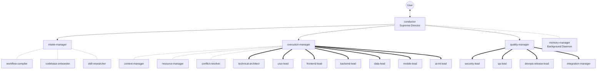

# 🏢 AgenticDev: Autonomous AI Software Company Framework

> An **SEO-optimized, production-ready autonomous multi-agent software engineering company** built for [Google Antigravity (AGY)](https://antigravity.dev).
> Drop this .agents/ folder into any workspace to instantly deploy **58 specialized AI software engineers**, **23 rich skill guides**, and **6 automated workflows**. Build, test, and release real software with an autonomous AI developer team.

[](#-agent-roster)
[](#-skills-library)
[](#-workflows)
[](#-architecture-overview)
[](./LICENSE)

---

## 📋 Table of Contents

- [What's New: Neural Orchestra v4](#-whats-new-neural-orchestra-v4)
- [Enterprise Resilience (Day-2 Ops)](#-enterprise-resilience-day-2-ops)
- [Architecture Overview](#-architecture-overview)
- [Project Type Routing](#-project-type-routing)
- [Phase Gate System](#-phase-gate-system)
- [Adaptable Pipeline](#-adaptable-pipeline)
- [Rate Limiting, Caching & Stress Testing](#-rate-limiting-caching--stress-testing)
- [Agent Roster](#-agent-roster)
- [Skills Library](#-skills-library)
- [Workflows](#-workflows)
- [Quick Start](#-quick-start)
- [Contributing](#-contributing)

---

## 🎉 What's New: Neural Orchestra v4

The monolithic `project-manager` has been completely replaced by the **Neural Orchestra** — a distributed, brain-like management layer that radically improves token efficiency, parallel execution, and quality control.

- **The Conductor (`conductor`)**: The ultra-thin user-facing entry point. It receives requests, classifies them, routes to specialized managers, and surfaces the final results.
- **6 Specialized Managers**:
  - `intake-manager`: Handles user interviews, project classification, and feature manifests.
  - `execution-manager`: Runs workflow phases, enforces gates, and handles rollbacks via deep `git reset --hard`.
  - `quality-manager`: Runs 4 quality gates in parallel (Compliance, QA, Security, UI) and tracks agent reputation.
  - `context-manager`: Generates targeted, per-agent context snapshots to save tokens.
  - `memory-manager`: Runs as a background daemon processing the `event-queue.jsonl` to validate, deduplicate, and cross-share lessons across agents.
  - `resource-manager`: Optimizes model usage (`pro`/`flash`/`flash_lite`) and tracks token budgets.
- **Dynamic Workflows (`workflow-compiler`)**: For simple bug fixes or single features, it compiles a minimal custom workflow, avoiding the overhead of the full 6-phase pipeline.
- **Codebase Onboarding (`codebase-onboarder`)**: Quickly reverse-engineers external codebases using signature-only scanning (grep) to save tokens.
- **Auto-Refreshing Skills (`skill-researcher`)**: Skills now have a `refreshMode`. Stale skills are sequentially researched and updated from the web to avoid API rate limits.
- **Professional UI Craft (`professional-ui-craft`)**: New protected skill enforcing color psychology, cognitive design laws, and an anti-vibe-code blacklist.

---

## 🛡️ Enterprise Resilience (Day-2 Ops)

v4.0.0 introduces massive "Day 2" operational stability upgrades to ensure the AI agents act like a real engineering team and never get stuck in infinite token-burning loops:

- **Universal UX Relay**: Any worker agent can send a `[QUESTION_TO_USER]` or hit an `[APPROVAL_REQUIRED]` checkpoint. The Conductor will pause the entire pipeline, safely suspend liveness timers, and ask you directly via a UI prompt before proceeding.
- **Shift-Left Local Testing**: Agents are now mathematically blocked from infinite debugging loops. The Architect generates a `localVerificationCommand` (e.g., `tsc --noEmit` or `flutter analyze`). Workers **must** run this locally and are hard-capped at 3 retries before they are forced to escalate to their Lead.
- **Mandatory Bootstrapping**: Leads are strictly required to run `npm install` and auto-generate safe `.env.local` files with mock data *before* delegating tasks, ensuring that local shift-left tests actually boot instead of crashing instantly.
- **Self-Healing QA Routing**: When tests fail, the QA Lead no longer fails the entire phase. Instead, it scans the `file-responsibility-index.json`, finds the exact worker who wrote the broken file, and routes the error log directly to them via `send_message`.
- **Zero-Cost Package Vetting**: Before adding any dependencies to `package.json`, Leads must execute `npm view <package> deprecated time.modified --json` in the sandbox to verify the package is actively maintained, preventing the integration of dead/deprecated libraries.
- **Git-Backed Conflict Resolution**: The `conflict-resolver` and `integration-manager` no longer blindly overwrite files using LLM context. They now strictly rely on standard git markers (`<<<<<<< HEAD`) and unified diffs to fix conflicts cleanly.
- **Strict Memory Anti-Bloat**: The `memory-manager` enforces hard item limits (`error-registry.json` capped at 20 fingerprints; individual agent `memory.json` capped at 15) to prevent the "Global Brain" from consuming massive token budgets over months of use.

---

## 🏛️ Architecture Overview

The multi-agent system structure mirrors a real company with a distributed management layer.


```mermaid
flowchart TD
    USER((User)) <--> C[conductor\nSupreme Director]
    
    C --> IN[intake-manager]
    C --> EM[execution-manager]
    C --> QM[quality-manager]
    
    EM -.- CX[context-manager]
    EM -.- RM[resource-manager]
    EM -.- CR[conflict-resolver]
    
    IN -.- WC[workflow-compiler]
    IN -.- CO[codebase-onboarder]
    IN -.- SR[skill-researcher]

    C -.- MM[memory-manager\nBackground Daemon]
    
    EM ==> TA[technical-architect]
    EM ==> UI[uiux-lead]
    EM ==> FE[frontend-lead]
    EM ==> BE[backend-lead]
    EM ==> DL[data-lead]
    EM ==> ML[mobile-lead]
    EM ==> AI[ai-ml-lead]
    
    QM ==> SEC[security-lead]
    QM ==> QA[qa-lead]
    QM ==> DEV[devops-release-lead]
    QM ==> IM[integration-manager]
```

---

## 🔀 Project Type Routing

The `intake-manager` auto-detects the project type and activates the correct workflow:

| Project Type | Activated Departments | Omitted / Reduced |
|---|---|---|
| **Fullstack Web App** | All standard leads (FE, BE, Data, QA, etc.) | N/A |
| **AI/RAG** | `ai-ml-lead` + core backend | `frontend-lead` (omitted or reduced) |
| **Mobile** | `mobile-lead` + core backend | `frontend-lead` (omitted) |
| **Automation** | `automation-workflow-worker` + BE | `frontend-lead` (omitted) |
| **API-Only** | BE, Data, QA | `frontend-lead`, `uiux-lead` |
| **Targeted Fix/Feature** | Dynamically compiled by `workflow-compiler` | All unused departments |

---

## 🚦 Phase Gate System

Agents cannot advance to the next phase without producing required artifacts, enforced by the `execution-manager` and `quality-manager`.

1. **Planning Gate**: `project-plan.json`
2. **Architecture Gate**: `architecture.json` + `api-contract.json`
3. **UX Gate**: Hard prerequisite before frontend implementation starts.
4. **Implementation Gate**: Hand-off reports from all active leads. (Features Interactive Approval Gate).
5. **Integration Gate**: `integration-report.json` (build PASS).
6. **Stress Testing Gate**: QA load test and rate-limit validation.
7. **Observability Gate (BLOCKING)**: `observability-report.json` (PASS).
8. **Quality Gate (Unified)**: Compliance, QA, Security, and UI gates must all PASS.

---

## ⚡ Rate Limiting, Caching & Stress Testing

Performance and resilience are treated as first-class citizens:
- **Architecture**: Rate limiting and caching strategies are mandated in the initial design.
- **Backend**: Skill guides enforce Redis caching patterns and token bucket rate limits.
- **Stress Testing**: The `stress-test-worker` validates these boundaries under load using `k6`/`Locust` before release.

---

## 👥 Agent Roster

The system comprises 58 agents across 9 departments.

**The Neural Orchestra (Management)**
- `conductor`: Supreme Director (main entry point)
- `intake-manager`: Project intake, interviews, classification
- `execution-manager`: Workflow runner, phase gates, rollback
- `quality-manager`: Parallel quality gatekeeper
- `context-manager`: Tailored context snapshots
- `memory-manager`: Event queue processing & knowledge sharing
- `resource-manager`: Token budget & model tier assignments
- `workflow-compiler`: Dynamic workflow generation
- `conflict-resolver`: Parallel stream conflict detection
- `skill-researcher`: Auto-refreshes skill files
- `codebase-onboarder`: Token-efficient external codebase scanning
- `project-manager`: *(Deprecated - use conductor)*
- `workflow-manager`: *(Deprecated - use execution-manager)*

**Architecture & Integration**
- `technical-architect`: Interviews user & designs architecture
- `integration-manager`: Handles merge conflicts & build verification

**Frontend Department**
- `frontend-lead`, `ui-component-worker`, `routing-worker`, `state-management-worker`, `api-integration-worker`, `frontend-test-worker`, `accessibility-worker`, `performance-worker`, `localization-worker`

**Backend Department**
- `backend-lead`, `api-route-worker`, `auth-worker`, `business-logic-worker`, `data-access-worker`, `backend-test-worker`, `error-handling-worker`, `analytics-worker`, `automation-workflow-worker`

**Data Department**
- `data-lead`, `schema-design-worker`, `migration-worker`, `seed-data-worker`

**Mobile Department**
- `mobile-lead`, `mobile-screen-worker`, `push-notification-worker`

**UI/UX Department**
- `uiux-lead`, `mockup-wireframe-worker`

**AI/ML Department**
- `ai-ml-lead`, `rag-pipeline-worker`, `llm-config-worker`, `vector-db-worker`

**QA & Security**
- `security-lead`, `qa-lead`, `unit-test-worker`, `integration-test-worker`, `regression-test-worker`, `browser-e2e-tester`, `stress-test-worker`

**DevOps & Cross-Cutting**
- `devops-release-lead`, `ci-pipeline-worker`, `docker-worker`, `release-notes-worker`, `observability-worker`, `documentation-agent`, `code-reviewer`

---

## 📚 Skills Library

Agents pull from 23 specialized skill guides located in `.agents/skills/` (now with `refreshMode` auto-updating):
1. `agy-customizations`
2. `ai-ml-engineering` 
3. `analytics-tracking`
4. `antigravity-guide`
5. `api-design`
6. `architecture-design`
7. `backend-development`
8. `code-review`
9. `database-engineering`
10. `devops-practices`
11. `flutter-development`
12. `frontend-development`
13. `git-integration`
14. `load-testing` 
15. `localization`
16. `mobile-notifications`
17. `observability`
18. `performance-optimization`
19. `professional-ui-craft` (NEW)
20. `react-patterns`
21. `security-review`
22. `software-project-management`
23. `testing`

---

## 📋 Workflows

6 robust pipelines configured in `.agents/workflows/` (plus dynamic generation):
1. **Full Lifecycle Greenfield Project** (6 phases, fullstack/api-only/frontend-only)
2. **Brownfield Codebase Update** (6 phases, all project types)
3. **Parallel Feature Development** (3 phases, all project types)
4. **Integration and Release** (5 phases, all project types)
5. **AI/RAG/LLM Project** (6 phases, ai-rag projects)
6. **Automation Workflow Project** (4 phases, automation projects)
*Note: Targeted bug fixes and small features bypass these in favor of a dynamically compiled workflow.*

---

## 🚀 Quick Start

1. **Clone the Framework**
   ```bash
   git clone https://github.com/codinghubindia/agentic-dev.git my-project
   cd my-project
   ```
2. **Open in Antigravity**
   ```bash
   agy
   ```
3. **Engage the Conductor**
   Ping `conductor` and describe your goal:
   > "Build an AI-powered semantic search tool with RAG, backend APIs, and a Next.js frontend."

---

## 🤝 Contributing

Contributions to the agents' system prompts, skills, and workflows are highly encouraged. Please refer to `.agents/CONTRIBUTING.md` for guidelines on submitting pull requests.
