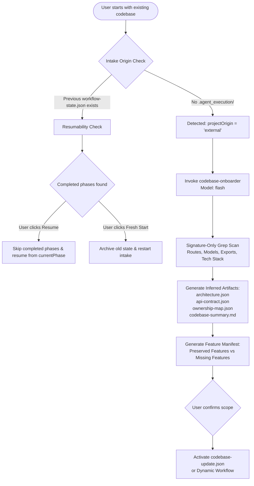
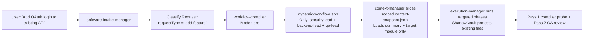
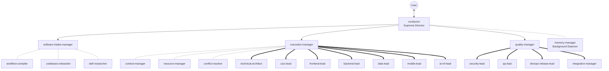

# 🏢 AgenticDev: Autonomous AI Software Company Framework

> An **enterprise-grade, production-ready autonomous multi-agent software engineering company** built for [Google Antigravity (AGY)](https://antigravity.dev).
> Drop this `.agents/` directory into any workspace to deploy **62 specialized AI software engineers**, **23 authoritative engineering skills**, and **6 automated workflows** (plus dynamic on-demand compilation). Build, extend, refactor, and ship software with an autonomous AI developer enterprise.

[](#-agent-roster)
[](#-skills-library)
[](#-workflows)
[](#-architecture-overview)
[](#-token-economics--quantified-reduction)
[](./LICENSE)

---

## 📋 Table of Contents

- [What's New in v5.2 Hyper-Optimized](#-whats-new-in-v52-hyper-optimized)
- [Taking Over Half-Implemented Codebases](#-taking-over-half-implemented-codebases-brownfield-takeover)
- [Adding Features to Existing Projects](#-adding-features-to-existing-projects-targeted-extensions)
- [Token Economics & Quantified Reduction](#-token-economics--quantified-reduction)
- [Enterprise Resilience & Concurrency Safeguards](#-enterprise-resilience--concurrency-safeguards)
- [Architecture Overview](#-architecture-overview)
- [Project Type Routing](#-project-type-routing)
- [Phase Gate System](#-phase-gate-system)
- [Agent Roster (62 Agents)](#-agent-roster)
- [Skills Library (23 Skills)](#-skills-library)
- [Workflows](#-workflows)
- [Quick Start](#-quick-start)
- [Contributing](#-contributing)

---

## 🚀 What's New in v5.2 Hyper-Optimized

The framework has evolved into an enterprise-ready, self-learning, token-optimized autonomous software organization:

- **The Ultra-Thin Conductor (`conductor`)**: The Supreme Director and single user-facing entry point. Mathematically the **only agent** with UI rendering privileges (`ask_question`). All 61 subagents communicate via typed `[QUESTION_TO_USER]` relays, guaranteeing zero uncoordinated prompts or deadlocks.
- **Dynamic Brownfield Archaeology (`codebase-onboarder`)**: Reverse-engineers half-implemented or external codebases in a single low-cost pass using signature-only scans (`grep`/`find`), producing instant contracts and module boundaries without full-file token burn.
- **Dynamic Workflow Compilation (`workflow-compiler`)**: Instead of spinning up heavy multi-phase pipelines for minor tasks, compiles surgical 2-to-3 phase dynamic workflows that activate only the exact specialist agents needed.
- **The "Dumb Worker" Protocol**: Worker subagents are forbidden from ingesting full skill manuals (~5k–8k tokens each). Leads extract the 3–5 actionable rules into the task prompt, cutting reference reading by >90%.
- **Domain Abstract Index (`domain-abstracts.json`)**: Completing workers register concise interface abstracts (<120 words). Peers read abstracts instead of raw source code, eliminating $O(N^2)$ cross-file token re-ingestion.
- **Shared Search Cache & Web Circuit Breaker**: Upgraded web search and unblocking protocol across all 62 agents with query caching (`search-cache.json`), 3-search-per-task caps, and 2-second backoff on HTTP 429 rate limits.
- **Partitioned Concurrency Safeguards**: Parallel workers write to isolated partition ledgers (`.agent_execution/partitions/`), atomically merged at phase completion by `execution-manager` to eliminate write clobbers and race conditions.
- **Dual-Pass QA**: Pass 1 runs deterministic compiler/linter checks (`tsc --noEmit`, `cargo check`, `mypy`) in the terminal at **0 LLM tokens**; Pass 2 evaluates targeted Git diffs with senior review leads.
- **Shadow Vault Untracked File Immutability**: Targeted sniper rollbacks compare against pre-phase manifests (`phase_[id]_before.json`), guaranteeing that user-created untracked files (`.env`, local scripts, custom configs) are never touched or deleted.
- **Self-Evolving System (`chief-of-staff`)**: Runs during project retrospectives to distill runtime lessons into permanent architectural rules, updating `agent.md` prompts so the company learns and prevents recurring bugs.

---

## 🧩 Taking Over Half-Implemented Codebases (Brownfield Takeover)

What happens when you drop the framework into an existing, half-finished repository?


```mermaid
flowchart TD
    START([User starts with existing codebase]) --> OD{Intake Origin Check}
    OD -->|No .agent_execution/| EXT[Detected: projectOrigin = 'external']
    OD -->|Previous workflow-state.json exists| RES[Resumability Check]
    
    RES --> ASK_RES{Completed phases found}
    ASK_RES -->|User clicks Resume| CONT[Skip completed phases & resume from currentPhase]
    ASK_RES -->|User clicks Fresh Start| ARCHIVE[Archive old state & restart intake]
    
    EXT --> ONBOARD[Invoke codebase-onboarder\nModel: flash]
    ONBOARD --> SIG_SCAN[Signature-Only Grep Scan\nRoutes, Models, Exports, Tech Stack]
    SIG_SCAN --> ARTIFACTS[Generate Inferred Artifacts:\narchitecture.json\napi-contract.json\nownership-map.json\ncodebase-summary.md]
    
    ARTIFACTS --> MANIFEST[Generate Feature Manifest:\nPreserved Features vs Missing Features]
    MANIFEST --> CONFIRM{User confirms scope}
    CONFIRM --> WORKFLOW[Activate codebase-update.json\nor Dynamic Workflow]
```

### 1. Automatic Origin & Resumability Detection
- `software-intake-manager` inspects the root workspace:
  - If `.agent_execution/workflow-state.json` exists with `completedPhases[]`, it prompts the user:
    > *"A previous run was found. Completed phases: [Phase 1, Phase 2]. Resume from where it stopped or start fresh?"*
    Selecting **Resume** immediately bypasses completed work, loads existing state, and resumes execution seamlessly.
  - If source files exist (`src/`, `package.json`, `app/`, `go.mod`, etc.) but no framework artifacts exist, it flags `projectOrigin: "external"`.

### 2. Signature-Only Archaeology Scan (`codebase-onboarder`)
- External codebases are scanned without reading full source files:
  - **Routes**: Greps route definitions (`router.get`, `app.post`, `@app.get`, Next.js route handlers).
  - **Data Models**: Greps entity patterns (`model `, `@Entity`, `new Schema`, `class .*Base`).
  - **Public APIs**: Greps exported functions, types, and DTOs.
  - **Tech Stack**: Reads package manifests (`package.json`, `requirements.txt`, etc.).
- Generates 5 foundational artifacts in `.agent_execution/`:
  1. `architecture.json`: Inferred stack, topologies, and verified build commands (marked `"source": "inferred"`).
  2. `api-contract.json`: All detected endpoints, HTTP methods, and inferred payloads.
  3. `ownership-map.json`: Partitions existing directories to specialized leads (e.g. `frontend/` to `frontend-lead`, `server/` to `backend-lead`).
  4. `file-responsibility-index.json`: Maps existing files to inferred responsibilities.
  5. `codebase-summary.md`: A human-readable, compressed project overview (<5KB).

### 3. Feature Manifest Gap Analysis
- `software-intake-manager` generates `feature-manifest.md` clearly differentiating:
  - **Existing / Preserved Features**: Code already implemented and working.
  - **Remaining / Missing Features**: Gaps identified from the user interview and requirements.
- The user reviews and approves the scope before any worker writes code.

---

## ⚡ Adding Features to Existing Projects (Targeted Extensions)

What happens when you ask the framework to add a feature to an already implemented project?


```mermaid
flowchart LR
    REQ["User: 'Add OAuth login to existing API'"] --> INTAKE[software-intake-manager]
    INTAKE --> CLASSIFY[Classify Request:\nrequestType = 'add-feature']
    CLASSIFY --> COMPILER[workflow-compiler\nModel: pro]
    COMPILER --> DYNAMIC_WF[dynamic-workflow.json\nOnly: security-lead + backend-lead + qa-lead]
    
    DYNAMIC_WF --> SNAPSHOT[context-manager slices\nscoped context-snapshot.json\nLoads summary + target module only]
    SNAPSHOT --> EXECUTE[execution-manager runs targeted phases\nShadow Vault protects existing files]
    EXECUTE --> VERIFY[Pass 1 compiler probe + Pass 2 QA review]
```

### 1. Request Classification
- The intake engine classifies the request by intent:
  - Keywords like `"add"`, `"new feature"`, `"implement"`, `"build X into existing project"` set `requestType: "add-feature"`.
  - Sets `recommendWorkflowCompiler: true`.

### 2. Minimal Dynamic Workflow Compilation
- Rather than running all 6 phases of a greenfield project (which would waste hundreds of thousands of tokens running database designers, mobile leads, and stress testers), `workflow-compiler` produces a custom `dynamic-workflow.json`:
  - **Phase 1 (Targeted Contract Spec)**: `technical-architect` or `security-lead` defines only the new endpoint or interface in `api-contract.json`.
  - **Phase 2 (Implementation)**: Only the owning lead and worker (e.g. `backend-lead` + `auth-worker`) are spawned.
  - **Phase 3 (Deterministic Machine QA & Sign-Off)**: `backend-test-worker` adds tests, Pass 1 compiles cleanly, and `quality-manager` signs off.
  - **Bypassed**: Database migrations (if unchanged), mobile screens, documentation overhauls, and stress testing are automatically omitted.

### 3. Request-Scoped Context Slicing
- Agents do **not** read the whole codebase. `context-manager` prepares `context-snapshot.json` containing:
  - The compressed `codebase-summary.md` (<5KB).
  - The specific module directory from `ownership-map.json`.
  - The targeted endpoint slice from `api-contract.json`.
- Token consumption drops by **85% to 90%** compared to full-pipeline execution.

### 4. Non-Destructive Pre-Phase Shadow Vault
- Before the new feature is written, `.agent_execution/manifests/phase_[id]_before.json` records a manifest of all existing files.
- If the new feature fails verification, targeted sniper rollback reverts only the files created or modified for that feature. All existing application files remain untouched and immutable.

---

## 💰 Token Economics & Quantified Reduction

By eliminating redundant reading loops, raw source code re-ingestion, and LLM-based syntax checking, overall token usage is cut by **65% to 75% on full builds** and **85% to 90% on targeted tasks**.

| Project Scenario | Legacy Architecture | v5.2 Hyper-Optimized | Net Savings |
|---|---|---|---|
| **Targeted Bug Fix / Single Endpoint** | 150,000 – 250,000 tokens | **15,000 – 30,000 tokens** | **~88% Reduction** |
| **Incremental Feature Addition** | 300,000 – 500,000 tokens | **60,000 – 110,000 tokens** | **~78% Reduction** |
| **Full Greenfield Application (E2E)** | 900,000 – 1,600,000+ tokens | **280,000 – 460,000 tokens** | **~70% Reduction** |

### Where the Tokens Were Saved:
1. **The "Dumb Worker" Rule**: Workers do not read 8,000-token skill manuals. Leads extract 3–5 bullets into the task prompt. *(Saves ~40,000 tokens/phase)*
2. **Domain Abstract Index (`domain-abstracts.json`)**: Compact interface digests replace raw 500-line file reading across agents. *(Saves ~50,000 tokens/feature)*
3. **Context Slicing (`context-manager`)**: Slices monolithic contracts into <100-line per-agent snapshots. *(Saves ~12,000 tokens/agent)*
4. **Dual-Pass QA (Pass 1 Machine Verification)**: Compilers (`tsc`, `mypy`, `cargo check`) catch typos at 0 LLM tokens, replacing expensive multi-agent LLM review cycles. *(Saves ~80,000 tokens/build)*
5. **Shared Search Cache & Error Registry**: Solutions to compiler quirks and package deprecations are cached once and shared across all workers. *(Saves ~20,000 tokens/debugging session)*
6. **Dynamic Workflow Compilation**: Eliminates unused phases and dormant agents for non-greenfield tasks. *(Saves ~150,000 tokens/update)*

---

## 🛡️ Enterprise Resilience & Concurrency Safeguards

The framework provides ironclad operational stability against real-world failure modes:

| Challenge | Failure Mode | v5.2 Automated Safeguard |
|---|---|---|
| **Web Rate Limits** | Parallel agents querying search APIs simultaneously trigger HTTP 429 errors. | **Shared Search Cache & Circuit Breaker**: Pre-checks `.agent_execution/search-cache.json`. Capped at 3 searches/task with 2s backoff. |
| **Concurrency Write Clobbers** | Parallel workers overwriting shared JSON ledgers simultaneously corrupt index data. | **Partitioned Ledgers**: Workers write to `.agent_execution/partitions/`. `execution-manager` atomically merges them on phase completion. |
| **User Latency & Stall** | Agents waiting for human browser review trigger liveness timeouts. | **Human-Waiting Grace State**: Liveness timers gracefully pause while human users review UI checkpoints. Approval loops have a 3-cycle circuit breaker. |
| **Accidental Data Loss** | Rollback on failure deletes pre-existing untracked files (`.env`, local scripts). | **Untracked File Immutability**: Rollbacks check against pre-phase manifests. Pre-existing untracked files are strictly immutable. |
| **Port Conflicts** | Zombie dev servers from test runs lock ports (`EADDRINUSE`). | **Port Pre-Flight & Ephemeral Ports**: Test commands require non-daemon execution; pre-flight checks kill orphan test listeners. |
| **Secrets Bleed** | Workers hardcode API keys or credentials into source code. | **Automated Secret Sentinel**: Gate 3 runs automated entropy and regex checks on all modified files before release sign-off. |
| **Dependency Drifts** | Loose version ranges (`^`, `~`, `*`) cause breaking transitive updates. | **Strict Version Pinning Mandate**: All dependencies must use exact pinned version numbers across all manifests. |
| **Path Mismatches** | Windows backslashes `\` break cross-platform contracts. | **Canonical POSIX Path Normalization**: All paths in contracts, manifests, and indexes enforce forward slashes `/`. |

---

## 🏛️ Architecture Overview

The multi-agent system structure mirrors an autonomous software company with distributed governance:


```mermaid
flowchart TD
    USER((User)) <--> C[conductor\nSupreme Director]
    
    C --> IN[software-intake-manager]
    C --> EM[execution-manager]
    C --> QM[quality-manager]
    
    EM -.- CX[context-manager]
    EM -.- RM[resource-manager]
    EM -.- CR[conflict-resolver]
    
    IN -.- WC[workflow-compiler]
    IN -.- CO[codebase-onboarder]
    IN -.- SR[skill-researcher]

    C -.- MM[memory-manager\nBackground Daemon]
    
    EM ==> TA[technical-architect]
    EM ==> UI[uiux-lead]
    EM ==> FE[frontend-lead]
    EM ==> BE[backend-lead]
    EM ==> DL[data-lead]
    EM ==> ML[mobile-lead]
    EM ==> AI[ai-ml-lead]
    
    QM ==> SEC[security-lead]
    QM ==> QA[qa-lead]
    QM ==> DEV[devops-release-lead]
    QM ==> IM[integration-manager]
```

---

## 🔀 Project Type Routing

The `software-intake-manager` auto-detects project classification and configures the exact pipeline:

| Project Type | Activated Departments | Omitted / Reduced Departments |
|---|---|---|
| **Fullstack Web App** | All standard leads (FE, BE, Data, QA, etc.) | None |
| **AI/RAG/LLM** | `ai-ml-lead`, Vector DB, Backend, Data | Frontend (omitted or headless) |
| **Mobile App** | `mobile-lead`, Push Notifications, Backend | Web Frontend (omitted) |
| **Automation / Workflow** | `automation-workflow-worker`, Backend, Devops | Web Frontend (omitted) |
| **API-Only Backend** | Backend, Data, QA, Security | Frontend, UI/UX (omitted) |
| **Targeted Fix / Feature** | Dynamically compiled by `workflow-compiler` | All unused departments bypassed |

---

## 🚦 Phase Gate System

No phase can advance without producing validated artifacts, verified by `execution-manager` and `quality-manager`:

1. **Intake Gate**: `intake-report.json` + confirmed `feature-manifest.md`.
2. **Architecture Gate**: `architecture.json` + `api-contract.json` + `ownership-map.json`.
3. **Data Modeling Gate**: `schema-design.md` + migration scripts.
4. **UI/UX Gate**: `design-system.md` + `component-specs.md` (or `micro-design-spec.md`).
5. **Implementation Gate**: Hand-off reports from leads + domain abstracts + Interactive Human Approval checkpoint (`[APPROVAL_REQUIRED]`).
6. **Pass 1 Machine Verification**: Terminal compilation & syntax verification at 0 LLM tokens.
7. **Unified Quality Gate**: Simultaneous audit across Compliance, QA, Security, and UI quality.
8. **Release Packaging**: `release-report.json` + `CHANGELOG.md`.

---

## 👥 Agent Roster

The system comprises **62 agents across 9 departments**:

| Department | Agents |
|---|---|
| **Executive Management** | `conductor`, `software-intake-manager`, `execution-manager`, `quality-manager`, `context-manager`, `resource-manager`, `hr-manager`, `chief-of-staff`, `memory-manager`, `conflict-resolver`, `workflow-compiler`, `workflow-manager`, `codebase-onboarder`, `skill-researcher`, `project-manager` (legacy) |
| **Architecture & Governance** | `technical-architect`, `code-reviewer`, `security-lead` |
| **Backend Engineering** | `backend-lead`, `api-route-worker`, `business-logic-worker`, `data-access-worker`, `auth-worker`, `error-handling-worker`, `analytics-worker` |
| **Frontend Engineering** | `frontend-lead`, `ui-component-worker`, `routing-worker`, `state-management-worker`, `api-integration-worker`, `accessibility-worker`, `performance-worker`, `localization-worker` |
| **UI/UX Design** | `uiux-lead`, `mockup-wireframe-worker` |
| **Data Engineering** | `data-lead`, `schema-design-worker`, `migration-worker`, `seed-data-worker` |
| **Mobile Engineering** | `mobile-lead`, `mobile-screen-worker`, `push-notification-worker` |
| **AI / ML Engineering** | `ai-ml-lead`, `rag-pipeline-worker`, `vector-db-worker`, `llm-config-worker` |
| **QA & Verification** | `qa-lead`, `unit-test-worker`, `integration-test-worker`, `backend-test-worker`, `frontend-test-worker`, `browser-e2e-tester`, `regression-test-worker`, `stress-test-worker` |
| **DevOps & Release** | `devops-release-lead`, `docker-worker`, `ci-pipeline-worker`, `observability-worker`, `release-notes-worker`, `documentation-agent`, `automation-workflow-worker`, `integration-manager` |

---

## 📚 Skills Library

Contains **23 authoritative engineering manuals** in `.agents/skills/`:

| Skill | Focus Areas |
|---|---|
| `architecture-design` | API-first design, system boundaries, 12-factor apps, ADRs |
| `api-design` | REST conventions, idempotency, pagination, error schemas |
| `backend-development` | Express 5, Fastify, modular architecture, Redis rate limiting |
| `database-engineering` | PostgreSQL, MongoDB, migration idempotency, N+1 prevention |
| `frontend-development` | React 19, Vite 6, Tailwind CSS, TanStack Query v5, Zustand v5 |
| `uiux-design` | Visual hierarchy, 8-pt spacing, design tokens, responsive layouts |
| `professional-ui-craft` | Color psychology, cognitive laws, motion choreography, anti-vibe-code |
| `flutter-development` | Riverpod/Bloc, GoRouter, platform channels, offline storage |
| `ai-ml-engineering` | RAG pipelines, vector search, prompt patterns, cost optimization |
| `security-review` | OWASP Top 10, secret scanning, JWT rotation, input sanitization |
| `testing` | Vitest, Jest, Supertest, Playwright, coverage thresholds |
| `observability` | Prometheus metrics, Sentry integration, Pino structured logging |
| `devops-practices` | Multi-stage Dockerfiles, GitHub Actions CI/CD, health probes |
| `performance-optimization`| Core Web Vitals, Lighthouse auditing, bundle reduction, virtualization |
| `git-integration` | Branching strategies, conventional commits, worktree isolation |
| `typescript-patterns` | Strict mode, discriminated unions, Zod runtime validation |
| `analytics-tracking` | Event taxonomy, PostHog/Mixpanel/Amplitude wrappers, PII scrubbing |
| `load-testing` | k6/Locust stress testing, p95/p99 latency baselines, soak testing |
| `localization` | i18next, Flutter Intl, RTL layout mirroring, Intl date/currency |
| `mobile-notifications` | FCM, APNs, deep-link payloads, background handlers |
| `react-patterns` | RSC, Suspense, Actions, Compound Components |
| `code-review` | Systematic audits, contract compliance, severity ranking |
| `software-project-management` | Task decomposition, milestone tracking, blocker management |

---

## ⚡ Workflows

Standard pipelines configured in `.agents/workflows/` (in addition to on-demand dynamic compilation):

1. **`software-project.json`** — Full lifecycle greenfield pipeline (Requirements $\to$ DB $\to$ Design $\to$ Core Implementation $\to$ QA $\to$ Stress Testing $\to$ Release).
2. **`codebase-update.json`** — Brownfield updates on existing code (Architecture review $\to$ Code inspection $\to$ Refactoring $\to$ Regression testing).
3. **`parallel-feature-development.json`** — Concurrent feature development across Backend, Frontend, Data, and Security streams with contract locks.
4. **`integration-and-release.json`** — Source tree harmonization, build validation, regression suites, and release packaging.
5. **`ai-rag-project.json`** — Dedicated AI lifecycle (Document chunking $\to$ Embeddings $\to$ Vector DB $\to$ RAG evaluation $\to$ UI wiring).
6. **`automation-workflow.json`** — Webhooks, n8n pipeline orchestration, scheduled jobs, and integration tests.

---

## 🏁 Quick Start

### 1. Clone the Framework
```bash
git clone https://github.com/codinghubindia/agentic-dev.git my-project
cd my-project
```

### 2. Launch Antigravity
```bash
agy
```

### 3. Engage the Conductor
Prompt `conductor` with your project goal:
> *"Build an AI-powered SaaS with RAG capabilities, a PostgreSQL database, and a Next.js dashboard."*

Or on an existing codebase:
> *"Take over this existing repository, reverse-engineer its architecture, and add a Stripe billing webhook endpoint."*

---

## 🤝 Contributing

Contributions to the agents' system prompts, skills, and workflows are highly encouraged. Please refer to `.agents/CONTRIBUTING.md` for guidelines on submitting pull requests.
