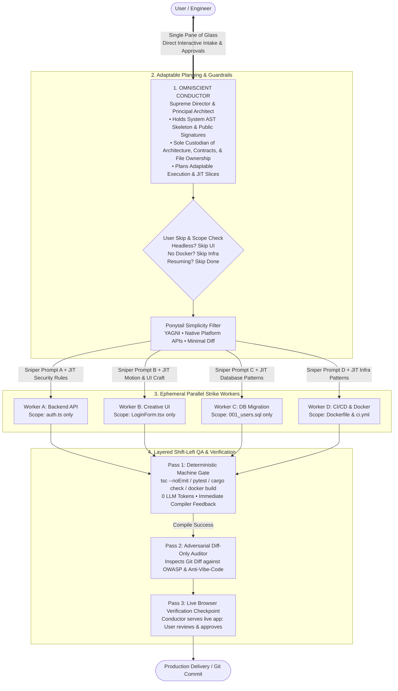

# 🎭 CEST: Lean Conductor & Ephemeral Strike Team
## Next-Generation Multi-Agent Software Engineering Architecture

> An **enterprise-grade, production-ready autonomous software engineering system** built for [Google Antigravity (AGY)](https://antigravity.dev).
> Drop this `.agents/` directory into any workspace to deploy the **v7.0 CEST Engine**: **6 specialized AI software engineers**, **8 authoritative engineering skills**, **3 adaptive workflows**, and a **deterministic Python tooling suite**.

---

## 📋 Table of Contents

- [The Core Problem & The CEST Solution](#-the-core-problem--the-cest-solution)
- [Architecture Overview](#-architecture-overview)
- [The 5 Core Pillars](#-the-5-core-pillars)
  - [1. Omniscient Conductor](#1-the-omniscient-conductor)
  - [2. The Ponytail Protocol (Ladder of Laziness)](#2-the-ponytail-protocol-ladder-of-laziness)
  - [3. Just-In-Time (JIT) Skill Slicing](#3-just-in-time-jit-skill-slicing)
  - [4. Ephemeral Parallel Strike Workers](#4-ephemeral-parallel-strike-workers)
  - [5. Layered 4-Stage Shift-Left QA Gate](#5-layered-4-stage-shift-left-qa-gate)
- [Creative UI/UX & Kinetic Motion Standards](#-creative-uiux--kinetic-motion-standards)
- [Evolutionary Memory Engine](#-evolutionary-memory-engine)
- [Agent Roster (Core 6)](#-agent-roster-core-6)
- [Skills Library (8 Domain Manuals)](#-skills-library-8-domain-manuals)
- [Workflows & Adaptability](#-workflows--adaptability)
- [Deterministic Tooling Suite (`.agents/scripts/`)](#-deterministic-tooling-suite-agentsscripts)
- [Quantitative Economics & Speed](#-quantitative-economics--speed)
- [Quick Start](#-quick-start)

---

## ⚡ The Core Problem & The CEST Solution

Conventional AI engineering frameworks suffer from two fatal extremes:

1. **The Single Default Agent Trap (Cursor, Claude Code, Raw LLMs):**  
   Fast to start, but context degrades exponentially (*The Lost-in-the-Middle Problem*). Execution is strictly sequential, and agents suffer from **bug-hunt tunnel vision**—losing sight of global system boundaries while fighting local type errors.
2. **The Corporate Multi-Manager Bureaucracy (Legacy 60+ Agent Frameworks):**  
   Crippled by the **"Manager Tax"**. A user request is bounced through a heavy hierarchy of persistent managers, burning 50,000–90,000 tokens and 2–4 minutes of idle latency serializing intermediate JSON state files before writing any code.

### The CEST Paradigm Shift
CEST replaces the 60-agent bureaucracy with **a single strategic brain (Conductor) commanding stateless parallel execution pods (Ephemeral Strike Workers)**.

```mermaid
flowchart TD
    USER([User / Engineer]) <===>|Single Pane of Glass\nDirect Interactive Intake & Approvals| COND[1. OMNISCIENT CONDUCTOR\nSupreme Director & Principal Architect\n• Holds System AST Skeleton & Public Signatures\n• Sole Custodian of Architecture, Contracts, & File Ownership\n• Plans Adaptable Execution & JIT Slices]

    subgraph PLANNING [2. Adaptable Planning & Guardrails]
        COND --> ADAPT{User Skip & Scope Check\nHeadless? Skip UI\nNo Docker? Skip Infra\nResuming? Skip Done}
        ADAPT --> PONY[Ponytail Simplicity Filter\nYAGNI • Native Platform APIs • Minimal Diff]
    end

    subgraph EXECUTION [3. Ephemeral Parallel Strike Workers]
        PONY -->|Sniper Prompt A + JIT Security Rules| WA[Worker A: Backend API\nScope: auth.ts only]
        PONY -->|Sniper Prompt B + JIT Motion & UI Craft| WB[Worker B: Creative UI\nScope: LoginForm.tsx only]
        PONY -->|Sniper Prompt C + JIT Database Patterns| WC[Worker C: DB Migration\nScope: 001_users.sql only]
        PONY -->|Sniper Prompt D + JIT Infra Patterns| WD[Worker D: CI/CD & Docker\nScope: Dockerfile & ci.yml]
    end

    subgraph QUALITY [4. Layered Shift-Left QA & Verification]
        WA & WB & WC & WD --> MACH[Pass 1: Deterministic Machine Gate\ntsc --noEmit / pytest / cargo check / docker build\n0 LLM Tokens • Immediate Compiler Feedback]
        MACH -->|Compile Success| AUDIT[Pass 2: Adversarial Diff-Only Auditor\nInspects Git Diff against OWASP & Anti-Vibe-Code]
        AUDIT --> LIVE[Pass 3: Live Browser Verification Checkpoint\nConductor serves live app: User reviews & approves]
    end

    LIVE --> SHIP([Production Delivery / Git Commit])
```

---

## 🏛️ The 5 Core Pillars

### 1. The Omniscient Conductor
* **Direct User Connection:** Conductor talks directly to the user using native interactive prompts (`ask_question`). Zero intermediary telephone game.
* **Lightweight Public Signatures:** Holds only the AST Ghost Skeleton (< 2,500 tokens for 50,000-line repositories). Never ingests raw function bodies.
* **Need-to-Know Slicing:** Dispatches workers with only the exact 15-line schema and file boundaries they need.

### 2. The Ponytail Protocol (Ladder of Laziness)
Before any code is generated, tasks pass through Dietrich Gebert's **Ladder of Laziness**:
1. **YAGNI:** Delete speculative features before writing them.
2. **Reuse:** Leverage existing codebase helpers.
3. **Standard Library:** Use `crypto.randomUUID()`, native `URL`, and native `fetch`.
4. **Native Platform:** Use `<dialog>`, `<input type="date">`, and `
` over bloated npm packages.
5. **Anti-Package Sprawl:** Workers are strictly banned from running `npm install <new_pkg>` without explicit Conductor authorization.

### 3. Just-In-Time (JIT) Skill Slicing
Instead of forcing workers to read 600-line manuals (burning 20,000 tokens), the Conductor injects **hyper-focused 40-token constraint slices** directly into the worker's prompt (e.g. 60-30-10 color rules, 50ms stagger cascades, or OWASP parameterized query rules).

### 4. Ephemeral Parallel Strike Workers
* **Stateless 1-Shot Runners:** Workers boot in an isolated workspace, execute their Sniper Prompt, run a local verification test, output a git diff and SHA256 receipt (<50 tokens), and **terminate immediately**.
* **Zero Context Accumulation:** Workers leave no conversational exhaust in the active context window.

### 5. Layered 4-Stage Shift-Left QA Gate
* **Stage 0:** Local in-flight worker verification before reporting.
* **Stage 1 (Deterministic 0-Token Gate):** Local terminal compilers (`tsc --noEmit`, `cargo check`, `pytest`) verify syntax and types at zero token cost.
* **Stage 2 (Adversarial Diff-Only Audit):** `qa-auditor` reviews only the Git diff against OWASP Top 10, the Anti-Vibe-Code blacklist, and WCAG accessibility standards.
* **Stage 3 (Live Browser Checkpoint):** Conductor serves the assembled application at `localhost:3000` for live human review and approval.

---

## 🎨 Creative UI/UX & Kinetic Motion Standards

CEST categorically bans generic, bland "AI template" aesthetics.

### Visual Craft Rules:
* **Brand-Tinted Surfaces:** Absolute ban on pure dead white (`#ffffff`) or pure gray (`#808080`). All neutrals are tinted with 4%–8% of the brand's primary hue.
* **60-30-10 Color Hierarchy:** 60% tinted background, 30% structural secondary depth (crisp 1px borders, no muddy shadows), and 10% high-impact accent.
* **The Anti-Vibe-Code Blacklist:** Immediate rejection for emoji in functional UI (`🚀`, `🔥`), rainbow gradient text, card-in-card nesting (>2 levels), and generic spinning loaders.

### Kinetic Motion Standards:
* **Calibrated Duration Scale:** 50–100ms micro-feedback, 150–250ms element transitions, 250–350ms component entrances.
* **Spring Physics Default:** Damped spring transitions (`stiffness: 400, damping: 30`) over robotic linear easing.
* **50ms Stagger Cascades:** Lists and card grids animate in with a 50ms child delay wave.
* **Accessibility:** Mandatory `@media (prefers-reduced-motion: reduce)` fallbacks.

---

## 🧠 Evolutionary Memory Engine

CEST prevents memory bloat by enforcing a **Strict Negative-Knowledge Mandate**:
* **Learn ONLY from Failures:** Memory records *only* unexpected compiler traps, broken package versions, and runtime crashes into `.agent_execution/event-queue.jsonl`.
* **Zero Domain Bloat:** Normal successful runs generate **zero memory entries**. Project names and business domain terms are stripped.
* **Chief-of-Staff Distillation:** The asynchronous `chief-of-staff` agent distills recurring failure patterns into immutable negative invariants permanently written into agent system prompts under `## EVOLUTIONARY MEMORY`, immunizing the framework across all future runs.

---

## 👥 Agent Roster (Core 6)

| Agent | Model Tier | Role & Responsibilities |
|---|---|---|
| **`conductor`** | `pro` | Supreme Director, Principal Architect, and sole user-facing interface. Plans workflows, enforces Ponytail, slices skills, and manages file ownership. |
| **`strike-worker-backend`** | `flash` | Ephemeral 1-shot runner for REST/GraphQL APIs, auth services, database models, and unit tests. |
| **`strike-worker-frontend`** | `flash` | Ephemeral 1-shot runner for creative UI/UX, spring physics motion, and responsive component trees. |
| **`strike-worker-infra`** | `flash` | Ephemeral 1-shot runner for multi-stage Dockerfiles, GitHub Actions CI/CD, and health probing. |
| **`qa-auditor`** | `pro` | Adversarial diff-only inspector auditing code against OWASP Top 10, Anti-Vibe-Code, and WCAG rules. |
| **`chief-of-staff`** | `pro` | Evolutionary memory distillation engine converting runtime traps into permanent system invariants. |

---

## 📚 Skills Library (8 Domain Manuals)

| Skill | Purpose | Key Standards |
|---|---|---|
| **`ponytail`** | Anti-Overengineering Protocol | The Ladder of Laziness, YAGNI, native platform APIs, anti-package sprawl. |
| **`professional-ui-craft`** | Visual Design Standards | 60-30-10 rule, brand-tinted surfaces, Gestalt proximity, Anti-Vibe-Code blacklist. |
| **`modern-ui-motion`** | Kinetic Animation Choreography | Spring physics (`stiffness: 400`), 50ms stagger cascades, GPU transform optimization. |
| **`backend-engineering`** | API & Service Patterns | Zod validation, JWT authentication, RFC 9457 error shapes, rate limiting. |
| **`database-engineering`** | Schema Modeling & Integrity | Idempotent migrations, foreign key indexing, N+1 query prevention. |
| **`devops-infrastructure`** | CI/CD & Production Containers | Multi-stage Alpine Dockerfiles, GitHub Actions caching, liveness/readiness probes. |
| **`security-audit`** | Threat Modeling & Defense | OWASP Top 10, regex secret scanning, parameterized SQL, timing-safe equality. |
| **`testing-verification`** | Quality Assurance Strategy | 4-stage shift-left pyramid, 0-token compiler gates (`tsc`, `pytest`), Vitest unit tests. |

---

## 🔄 Workflows & Adaptability

CEST includes 3 adaptive workflows in `.agents/workflows/`:
1. **`cest-software-project.json`:** Greenfield fullstack delivery pipeline with interactive phase skipping (headless, no-test, no-docker).
2. **`cest-codebase-update.json`:** Brownfield takeover pipeline utilizing ghost skeleton archaeology and AST surgical grafting.
3. **`cest-quick-fix.json`:** Rapid single-turn surgical bugfix pipeline.

---

## 🛠️ Deterministic Tooling Suite (`.agents/scripts/`)

| Script | Purpose | Token Impact | Mechanics |
|---|---|---|---|
| **`ghost_skeleton.py`** | Multi-language AST signature extractor (TS, JS, Python, Go, Rust, Prisma, SQL). | **98% context reduction** | Traverses workspace in <1.5s, strips function bodies, extracts interfaces and route tables. |
| **`ast_surgery.py`** | Structural code grafting engine. | **Zero formatting bugs** | Performs targeted AST node replacements (`inject_import`, `append_route`, `replace_block`) avoiding full-file overwrites. |
| **`receipt_swapper.py`** | Content-addressable tool output garbage collection. | **99% output reduction** | Hashes raw stdout/stderr to disk and returns a 35-token structured receipt conforming to `receipt.schema.json`. |
| **`error_slicer.py`** | Compiler & test stack trace parser. | **95% diagnostic reduction** | Reduces 300-line stack traces to a 90-token Error Tuple `(file, line, column, error_code, message)`. |

---

## 📊 Quantitative Economics & Speed

| Scenario | Legacy Multi-Manager | Default Single Agent | CEST Architecture (v7.0) | Net Improvement |
| :--- | :--- | :--- | :--- | :--- |
| **Tokens per Feature** | ~110,000 tokens | ~65,000 tokens | **~21,950 tokens** | **75%+ Savings** |
| **Time to First Code File** | 2 min 45 sec | 12 sec | **6 sec** | **27x Faster** |
| **Fullstack Turnaround** | 7 min 10 sec | 5 min 30 sec | **1 min 45 sec** | **4x Faster** |
| **Context Longevity** | Fragmented | Collapses after Step 20 | **Pristine Indefinitely** | **Immune to Degradation** |

---

## 🚀 Quick Start

1. Ensure Python 3.8+ is installed on system `PATH` (for the 4 deterministic scripts; uses only standard library).
2. Start an Antigravity agentic session.
3. Select **`conductor`** as the main agent.
4. Issue your prompt (e.g. *"Build a real-time collaborative task board with Next.js, Fastify, and PostgreSQL"*).
5. Review the interactive scope confirmation modal, approve the manifest, and let the parallel strike workers execute.
