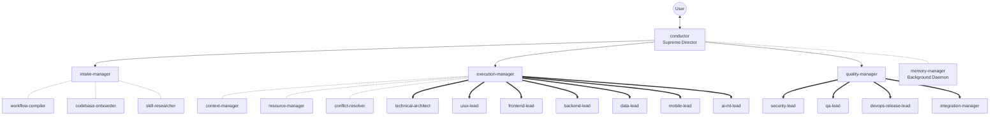

# 🏢 AgenticDev: Autonomous AI Software Company Framework

> An **SEO-optimized, production-ready autonomous multi-agent software engineering company** built for [Google Antigravity (AGY)](https://antigravity.dev).
> Drop this .agents/ folder into any workspace to instantly deploy **62 specialized AI software engineers**, **23 rich skill guides**, and **6 automated workflows**. Build, test, and release real software with an autonomous AI developer team.

[](#-agent-roster)
[](#-skills-library)
[](#-workflows)
[](#-architecture-overview)
[](./LICENSE)

---

## 📋 Table of Contents

- [What's New: Neural Orchestra v5.1 Hyper-Optimized](#-whats-new-neural-orchestra-v51-hyper-optimized)
- [Enterprise Resilience & Token Economics](#-enterprise-resilience--token-economics)
- [Architecture Overview](#-architecture-overview)
- [Project Type Routing](#-project-type-routing)
- [Phase Gate System](#-phase-gate-system)
- [Adaptable Pipeline](#-adaptable-pipeline)
- [Rate Limiting, Caching & Stress Testing](#-rate-limiting-caching--stress-testing)
- [Agent Roster](#-agent-roster)
- [Skills Library](#-skills-library)
- [Workflows](#-workflows)
- [Quick Start](#-quick-start)
- [Contributing](#-contributing)

---

## 🎉 What's New: Neural Orchestra v5.1 Hyper-Optimized

The framework has evolved into a self-learning, token-efficient software enterprise:

- **The Conductor (`conductor`)**: The Supreme Director and single user-facing entry point. It is mathematically the **only agent** with UI render tools (`ask_question`), safely relaying questions from all subagents via `[QUESTION_TO_USER]`.
- **The Agent Factory (`hr-manager`)**: Dynamically writes custom, temporary `agent.md` system prompts on the fly when the architect specifies technologies outside the default roster (e.g., Rust, Web3/Solidity, Game engines).
- **Self-Evolving Prompts (`chief-of-staff`)**: Runs during project retrospective to distill runtime lessons from `memory.json` into permanent architectural rules, rewriting core `agent.md` system prompts to eliminate recurring mistakes.
- **Dual-Axis Intake (`software-intake-manager`)**: Decouples the Core Engine (Scraper, Pipeline, API, Fullstack) from the Presentation Layer (Headless vs. Micro-UI vs. Full UI), auto-locking UI design for any visual tool.
- **The Micro-Design Spec (`uiux-lead`)**: Generates a lightweight, single-pass layout and token contract (`micro-design-spec.md` < 500 tokens) for scrapers and admin tools, saving ~15,000 tokens while guaranteeing visual craft.
- **Domain Abstract Index (`domain-abstracts.json`)**: All 33 workers register concise interface summaries (< 120 words). Peers read abstracts first, eliminating blind full-file ingestion and avoiding $O(N^2)$ broadcast storms.
- **Dual-Pass QA**: Pass 1 runs deterministic compilers/linters at 0 LLM tokens; Pass 2 evaluates targeted Git diffs via specialized QA leads.
- **Targeted Parallel Reverts & Shadow Vault**: Isolated file checkouts ensure parallel workers never clobber each other's code during rollbacks, backed by non-destructive pre-phase file vaults.

---

## 🛡️ Enterprise Resilience & Token Economics

v5.1 introduces industry-leading operational stability and cost controls:

- **Ironclad UX Relay**: The Conductor alone renders UI. All 61 subagents use `[QUESTION_TO_USER]` send_message packets. Background execution never hangs or stalls.
- **User-Gated Git Automation**: Git operations run automatically by default, but seamlessly fall back to local file vaults (`.agent_execution/backups/`) if the user requests "no git".
- **Chunked Diff Slicing**: When reviewing large codebase refactors (> 500 lines), `qa-lead` slices diffs file-by-file to keep token burn flat.
- **Universal Build Probes**: `technical-architect` auto-detects rare compilers (Cargo, Mix, Maven, Zig) or sets verification to `none` to avoid machine verification stalls.
- **Non-Daemon Verification Mandate**: Verification commands are strictly non-daemon (e.g. `tsc --noEmit`, `cargo check`), preventing port collisions and dev server deadlocks.
- **2-Second Jittered Stagger**: Spaces out parallel worker invocations by 2 seconds to eliminate API rate-limit (HTTP 429) bursts.
- **Shift-Left Local Testing**: Agents verify code locally using compiler commands, capped at 3 retries before escalating.
- **Zero-Cost Package Vetting**: Mandatory pre-verification of packages using sandbox `npm view` checks to reject abandoned dependencies.

---

## 🏛️ Architecture Overview

The multi-agent system structure mirrors a real company with a distributed management layer.


```mermaid
flowchart TD
    USER((User)) <--> C[conductor\nSupreme Director]
    
    C --> IN[intake-manager]
    C --> EM[execution-manager]
    C --> QM[quality-manager]
    
    EM -.- CX[context-manager]
    EM -.- RM[resource-manager]
    EM -.- CR[conflict-resolver]
    
    IN -.- WC[workflow-compiler]
    IN -.- CO[codebase-onboarder]
    IN -.- SR[skill-researcher]

    C -.- MM[memory-manager\nBackground Daemon]
    
    EM ==> TA[technical-architect]
    EM ==> UI[uiux-lead]
    EM ==> FE[frontend-lead]
    EM ==> BE[backend-lead]
    EM ==> DL[data-lead]
    EM ==> ML[mobile-lead]
    EM ==> AI[ai-ml-lead]
    
    QM ==> SEC[security-lead]
    QM ==> QA[qa-lead]
    QM ==> DEV[devops-release-lead]
    QM ==> IM[integration-manager]
```

---

## 🔀 Project Type Routing

The `intake-manager` auto-detects the project type and activates the correct workflow:

| Project Type | Activated Departments | Omitted / Reduced |
|---|---|---|
| **Fullstack Web App** | All standard leads (FE, BE, Data, QA, etc.) | N/A |
| **AI/RAG** | `ai-ml-lead` + core backend | `frontend-lead` (omitted or reduced) |
| **Mobile** | `mobile-lead` + core backend | `frontend-lead` (omitted) |
| **Automation** | `automation-workflow-worker` + BE | `frontend-lead` (omitted) |
| **API-Only** | BE, Data, QA | `frontend-lead`, `uiux-lead` |
| **Targeted Fix/Feature** | Dynamically compiled by `workflow-compiler` | All unused departments |

---

## 🚦 Phase Gate System

Agents cannot advance to the next phase without producing required artifacts, enforced by the `execution-manager` and `quality-manager`.

1. **Planning Gate**: `project-plan.json`
2. **Architecture Gate**: `architecture.json` + `api-contract.json`
3. **UX Gate**: Hard prerequisite before frontend implementation starts.
4. **Implementation Gate**: Hand-off reports from all active leads. (Features Interactive Approval Gate).
5. **Integration Gate**: `integration-report.json` (build PASS).
6. **Stress Testing Gate**: QA load test and rate-limit validation.
7. **Observability Gate (BLOCKING)**: `observability-report.json` (PASS).
8. **Quality Gate (Unified)**: Compliance, QA, Security, and UI gates must all PASS.

---

## ⚡ Rate Limiting, Caching & Stress Testing

Performance, resilience, and concurrency safeguards are treated as first-class citizens:
- **Shared Search Cache & Web Circuit Breaker**: Agents inspect `.agent_execution/search-cache.json` before querying external documentation. Queries are capped at 3 per task with 2-second backoff on 429 errors to protect upstream rate limits.
- **Partitioned Concurrency Safeguard**: Parallel streams write to isolated `.agent_execution/partitions/` ledgers (`file-index-*.json`, `domain-abstract-*.json`, `events-*.json`). `execution-manager` atomically merges them upon phase completion, eliminating file write race conditions.
- **Human-Waiting Grace State & Approval Circuit Breaker**: Liveness timers gracefully pause while human users review UI checkpoints via `[APPROVAL_REQUIRED]`; repetitive feedback cycles are capped with a 3-iteration circuit breaker before escalating to requirements review.
- **Shadow Vault Untracked File Immutability**: Targeted sniper rollbacks compare against `.agent_execution/manifests/phase_[id]_before.json`, guaranteeing that user untracked files (`.env`, local scripts, custom configs) are never deleted or clobbered.
- **Atomic State Commits**: All workflow state transitions commit via `.tmp` swap (`workflow-state.json.tmp` -> `workflow-state.json`) to prevent partial corruption.
- **Stress Testing**: The `stress-test-worker` validates API and system boundaries under load using `k6`/`Locust` before release.

---

## 👥 Agent Roster

The system comprises 62 agents across 9 departments.

**The Neural Orchestra (Management & Evolution)**
- `conductor`: Supreme Director (main entry point, exclusive UI renderer)
- `software-intake-manager`: Project intake, dual-axis classification, feature manifests
- `execution-manager`: Workflow runner, phase gates, shadow vault rollback
- `quality-manager`: Parallel quality gatekeeper
- `context-manager`: Tailored context snapshots & P2P abstract queries
- `memory-manager`: Event queue processing & knowledge sharing
- `resource-manager`: Token budget, model tiers & persona slotting
- `workflow-compiler`: Dynamic workflow generation
- `conflict-resolver`: Parallel stream conflict detection
- `hr-manager`: The Agent Factory (mints dynamic custom agents on the fly)
- `chief-of-staff`: Meta-Learning engine (rewrites agent system prompts from runtime lessons)
- `skill-researcher`: Auto-refreshes skill files
- `codebase-onboarder`: Token-efficient external codebase scanning
- `project-manager`: *(Deprecated - use conductor)*
- `workflow-manager`: *(Deprecated - use execution-manager)*

**Architecture & Integration**
- `technical-architect`: Interviews user & designs architecture
- `integration-manager`: Handles merge conflicts & build verification

**Frontend Department**
- `frontend-lead`, `ui-component-worker`, `routing-worker`, `state-management-worker`, `api-integration-worker`, `frontend-test-worker`, `accessibility-worker`, `performance-worker`, `localization-worker`

**Backend Department**
- `backend-lead`, `api-route-worker`, `auth-worker`, `business-logic-worker`, `data-access-worker`, `backend-test-worker`, `error-handling-worker`, `analytics-worker`, `automation-workflow-worker`

**Data Department**
- `data-lead`, `schema-design-worker`, `migration-worker`, `seed-data-worker`

**Mobile Department**
- `mobile-lead`, `mobile-screen-worker`, `push-notification-worker`

**UI/UX Department**
- `uiux-lead`, `mockup-wireframe-worker`

**AI/ML Department**
- `ai-ml-lead`, `rag-pipeline-worker`, `llm-config-worker`, `vector-db-worker`

**QA & Security**
- `security-lead`, `qa-lead`, `unit-test-worker`, `integration-test-worker`, `regression-test-worker`, `browser-e2e-tester`, `stress-test-worker`

**DevOps & Cross-Cutting**
- `devops-release-lead`, `ci-pipeline-worker`, `docker-worker`, `release-notes-worker`, `observability-worker`, `documentation-agent`, `code-reviewer`

---

## 📚 Skills Library

Agents pull from 23 specialized skill guides located in `.agents/skills/` (now with `refreshMode` auto-updating):
1. `agy-customizations`
2. `ai-ml-engineering` 
3. `analytics-tracking`
4. `antigravity-guide`
5. `api-design`
6. `architecture-design`
7. `backend-development`
8. `code-review`
9. `database-engineering`
10. `devops-practices`
11. `flutter-development`
12. `frontend-development`
13. `git-integration`
14. `load-testing` 
15. `localization`
16. `mobile-notifications`
17. `observability`
18. `performance-optimization`
19. `professional-ui-craft` (NEW)
20. `react-patterns`
21. `security-review`
22. `software-project-management`
23. `testing`

---

## 📋 Workflows

6 robust pipelines configured in `.agents/workflows/` (plus dynamic generation):
1. **Full Lifecycle Greenfield Project** (6 phases, fullstack/api-only/frontend-only)
2. **Brownfield Codebase Update** (6 phases, all project types)
3. **Parallel Feature Development** (3 phases, all project types)
4. **Integration and Release** (5 phases, all project types)
5. **AI/RAG/LLM Project** (6 phases, ai-rag projects)
6. **Automation Workflow Project** (4 phases, automation projects)
*Note: Targeted bug fixes and small features bypass these in favor of a dynamically compiled workflow.*

---

## 🚀 Quick Start

1. **Clone the Framework**
   ```bash
   git clone https://github.com/codinghubindia/agentic-dev.git my-project
   cd my-project
   ```
2. **Open in Antigravity**
   ```bash
   agy
   ```
3. **Engage the Conductor**
   Ping `conductor` and describe your goal:
   > "Build an AI-powered semantic search tool with RAG, backend APIs, and a Next.js frontend."

---

## 🤝 Contributing

Contributions to the agents' system prompts, skills, and workflows are highly encouraged. Please refer to `.agents/CONTRIBUTING.md` for guidelines on submitting pull requests.
