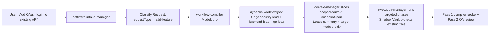
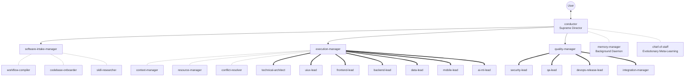

# 🏢 AgenticDev: Autonomous AI Software Company Framework

> An **enterprise-grade, production-ready autonomous multi-agent software engineering company** built for [Google Antigravity (AGY)](https://antigravity.dev).
> Drop this `.agents/` directory into any workspace to deploy **62 specialized AI software engineers**, **23 authoritative engineering skills**, **6 automated workflows** (plus dynamic on-demand compilation), and the **v6.0 Zero-Compounding Autonomous Software Engine (ZCASE)**. Build, take over, extend, refactor, and ship software with an autonomous AI developer enterprise.

[](#-agent-roster-62-specialists)
[](#-skills-library-23-engineering-manuals)
[](#-workflows)
[](#-the-zero-compounding-autonomous-software-engine-zcase)
[](#-strict-negative-knowledge-memory-engine)
[](#-token-economics--quantified-reduction)
[](./LICENSE)

---

## 📋 Table of Contents

- [What's New in v6.0 ZCASE Engine](#-whats-new-in-v60-zcase-engine)
- [The Zero-Compounding Autonomous Software Engine (ZCASE)](#-the-zero-compounding-autonomous-software-engine-zcase)
  - [Core Architectural Innovations](#core-architectural-innovations)
  - [Deterministic Tooling Suite (`.agents/scripts/`)](#deterministic-tooling-suite-agentsscripts)
- [Strict Negative-Knowledge Memory Engine](#-strict-negative-knowledge-memory-engine)
  - [The Memory Pollution Problem & The Zero-Pollution Mandate](#the-memory-pollution-problem--the-zero-pollution-mandate)
  - [Negative Knowledge Schema (`memory.json` v2)](#negative-knowledge-schema-memoryjson-v2)
  - [Rejection Filter in `memory-manager`](#rejection-filter-in-memory-manager)
  - [Self-Evolution via `chief-of-staff` Negative Invariants](#self-evolution-via-chief-of-staff-negative-invariants)
- [Real-World Edge Cases & Concrete Mitigations](#-real-world-edge-cases--concrete-mitigations)
- [Taking Over Half-Implemented Codebases (Brownfield Takeover)](#-taking-over-half-implemented-codebases-brownfield-takeover)
- [Adding Features to Existing Projects (Targeted Extensions)](#-adding-features-to-existing-projects-targeted-extensions)
- [Token Economics & Quantified Reduction](#-token-economics--quantified-reduction)
- [Enterprise Resilience & Concurrency Safeguards](#-enterprise-resilience--concurrency-safeguards)
- [Architecture Overview & Governance](#-architecture-overview--governance)
- [Project Type Routing](#-project-type-routing)
- [Phase Gate System](#-phase-gate-system)
- [Agent Roster (62 Specialists)](#-agent-roster-62-specialists)
- [Skills Library (23 Engineering Manuals)](#-skills-library-23-engineering-manuals)
- [Workflows](#-workflows)
- [Quick Start](#-quick-start)
- [Contributing](#-contributing)

---

## 🚀 What's New in v6.0 ZCASE Engine

The v6.0 release introduces the **Zero-Compounding Autonomous Software Engine (ZCASE)** and the **Strict Negative-Knowledge Memory Architecture**, completely eliminating the mathematical $O(N^2)$ context compounding trap and eradicating cross-project memory contamination:

1. **Strict Negative-Knowledge Memory Engine**: Memory is strictly failure-driven. If a project run succeeds with zero errors, **zero memory entries are written**. Project names, business logic, feature manifests, and user specifications are strictly banished. Memory records *only* unexpected compiler errors, runtime crashes, breaking package changes, and architectural traps.
2. **Content-Addressable Receipt Swapping (`receipt_swapper.py`)**: Terminal stderr outputs, test suites, and file dumps are hashed to `.agent_execution/receipts/<sha256>.log` and swapped in active context for $O(1)$ semantic receipts (<50 tokens). Past file reads are retroactively evicted upon task completion.
3. **Single-Shot Spec Synthesis (CIR)**: Features are authored via a dense **Compact Intermediate Representation** (`.agents/schemas/cir.schema.json`). Deterministic scaffolding emits validation, DTOs, migrations, and routes at **0 LLM tokens**, saving ~40,000 output tokens per feature.
4. **Polyglot Ghost Skeleton (`ghost_skeleton.py`)**: Extracts AST signatures across **TypeScript, JavaScript, Python, Go, Rust, Prisma, and SQL** in <1.5 seconds. Replaces 50,000-line raw codebases with a 1,200-token interface skeleton filtered to the query reachability graph.
5. **Concrete Syntax Tree (CST) Code Surgery (`ast_surgery.py`)**: Structural code grafting replacing fragile regex/line diffs. Performs targeted AST block replacements, import injections, and export appends with zero indentation or bracket errors.
6. **Tri-Phase Diagnostic Protocol & Error Slicing (`error_slicer.py`)**: Reduces 300-line stack traces to a 90-token Error Tuple `(file, line, culprit, error)`. Workers inspect local `.d.ts` declarations and test fixes in a 10-line scratch isolation sandbox before patching production code.
7. **The Ultra-Thin Conductor (`conductor`)**: The Supreme Director and single user-facing entry point. Mathematically the **only agent** with UI rendering privileges (`ask_question`). All 61 subagents communicate via typed `[QUESTION_TO_USER]` relays, guaranteeing zero uncoordinated prompts or deadlocks.
8. **Automated Brownfield Archaeology (`codebase-onboarder`)**: Reverse-engineers half-finished repositories in a single low-cost pass using signature-only scans (`grep`/`find`), generating instant contracts, file responsibility indexes, and module maps without full-file token burn.

---

## ⚡ The Zero-Compounding Autonomous Software Engine (ZCASE)

In conventional multi-agent frameworks, token consumption scales at **$O(N^2)$ compounding growth**: every tool call output, stack trace, and full-file read remains permanently stuck in conversation history. By Step 30, agents spend 90% of their tokens re-ingesting their own past conversational exhaust.

```
Conventional Multi-Agent (Compounding Exhaust):
Turn 1:  [Context: 4,000 tokens]
Turn 10: [Context: 48,000 tokens]  <-- 80% raw file dumps & logs
Turn 25: [Context: 140,000 tokens] <-- Model degrades, context window overflows, bills explode ($10-$20/run)

v6.0 ZCASE Engine (Zero-Compounding Linear Flatline):
Turn 1:  [Context: 1,800 tokens] (Pre-filtered CIR + Ghost Skeleton)
Turn 10: [Context: 2,400 tokens] (Outputs swapped for O(1) Receipts)
Turn 25: [Context: 2,900 tokens] (Deterministic AST Surgery; $0.15-$0.45/run)
```

### Core Architectural Innovations

```mermaid
flowchart TD
    subgraph Intake & Slicing
        IN[Incoming Request] --> CIR_GEN[CIR Generator / Technical Architect]
        CIR_GEN --> CIR[Compact Intermediate Representation\n<200 lines dense JSON]
        CODEBASE[50,000-Line Codebase] --> SKELETON[ghost_skeleton.py\nMulti-Language AST Scanner]
        SKELETON --> REACH[Reachability Slice\n1,200 tokens]
    end

    subgraph Execution & Surgery
        CIR --> RUNNER[Ephemeral 1-Shot Micro-Runner]
        REACH --> RUNNER
        RUNNER --> AST[ast_surgery.py\nDeterministic Node Grafting]
        AST --> FS[(Filesystem)]
    end

    subgraph Garbage Collection & Error Slicing
        FS --> VERIFY[Local Verification Command\ntsc / pytest / cargo check]
        VERIFY -->|Raw Stderr Dump| SLICER[error_slicer.py\nStack Trace Slicer]
        SLICER --> TUPLE[90-Token Error Tuple\nfile:line + culprit]
        VERIFY -->|Tool Output| SWAPPER[receipt_swapper.py\nContent-Addressable GC]
        SWAPPER --> LOG[(.agent_execution/receipts/<hash>.log)]
        SWAPPER --> RECEIPT[O(1) Semantic Receipt\n<50 tokens]
        RECEIPT --> RUNNER
        TUPLE --> RUNNER
    end
```

### Deterministic Tooling Suite (`.agents/scripts/`)

| Script | Purpose | Token Impact | Mechanics |
|---|---|---|---|
| **`ghost_skeleton.py`** | Multi-language AST signature extractor (TS, JS, Python, Go, Rust, Prisma, SQL). | **98% context reduction** | Traverses workspace in <1.5s, skips `node_modules`/`.git`, strips function bodies, extracts interfaces/types/structs/tables. Filters by target symbol reachability graph. |
| **`receipt_swapper.py`** | Content-addressable tool output garbage collection. | **99% output reduction** | Computes SHA256 of tool stdout/stderr, writes raw bytes to disk (`.agent_execution/receipts/<hash>.log`), and returns a 35-token structured receipt conforming to `receipt.schema.json`. |
| **`error_slicer.py`** | Deterministic compiler and test stack trace parser. | **98% diagnostic reduction** | Reduces 300-line stack traces (4,500 tokens) down to a 90-token Error Tuple `(file, line, column, errorCode, culpritSnippet, message)`. |
| **`ast_surgery.py`** | Structural code grafting engine. | **Zero formatting bugs** | Performs AST node replacement (`REPLACE_BLOCK`, `INSERT_BEFORE_RETURN`, `APPEND_EXPORT`, `INJECT_IMPORT`) avoiding fragile regex string replacements or full-file rewrites. |

---

## 🧠 Strict Negative-Knowledge Memory Engine

### The Memory Pollution Problem & The Zero-Pollution Mandate

In standard agent memory systems, agents store general project facts and domain descriptions (e.g., *"The project used React 18 for a fintech trading app with 4 screens"*). This causes four fatal problems in enterprise environments:
1. **Memory Bloat**: Memory files quickly hit size caps with useless natural language prose.
2. **Proprietary Data Leakage**: Domain details, feature manifests, and business logic from one project leak into unrelated subsequent client projects.
3. **Context Poisoning**: Future runs get biased toward previous domain logic.
4. **Redundancy**: Agents record truths already covered by static skills (e.g., *"Always write tests"*).

**The Zero-Pollution Mandate**:
> **Memory must ONLY learn from wrong things.**
> If a project or phase succeeds with ZERO unexpected errors or bugs, agents write **ZERO** memory entries. Success is the baseline expectation; only unexpected failures, breaking traps, and compiler bugs are recorded.
> Project names, feature requirements, user requests, domain concepts, and successful runs are **strictly forbidden** from entering memory.

### Negative Knowledge Schema (`memory.json` v2)

Every persistent memory file in `.agents/agents/<name>/memory.json` adheres to strict negative knowledge:

```json
{
  "version": 2,
  "agent": "backend-lead",
  "sizeBytes": 1280,
  "maxSizeBytes": 51200,
  "entries": [
    {
      "id": "neg_001",
      "timestamp": "2026-09-30T19:30:00Z",
      "failureMode": "Stripe webhook signature verification failed with HTTP 400",
      "rootCause": "express.json() parses body as object before signature verification, mutating the raw byte stream",
      "negativeConstraint": "NEVER mount express.json() before raw webhook routes; ALWAYS mount express.raw() first",
      "resolution": "app.use('/webhook', express.raw({type: 'application/json'}))",
      "source": "backend-lead",
      "tags": ["stripe", "express", "webhook"]
    }
  ]
}
```

### Rejection Filter in `memory-manager`

When agents append a `memory-write` event to `.agent_execution/event-queue.jsonl`, `memory-manager` runs a strict rejection filter before persisting:
- **Reject Domain / Project Details**: Any payload containing project names, domain terms (`"crypto"`, `"fintech"`, `"ecommerce"`), user requirements, or positive *"we built X"* statements is **immediately dropped**.
- **Require Failure Fields**: Must contain `failureMode`, `rootCause`, `negativeConstraint` (`"NEVER ...; ALWAYS ..."`), and `resolution`.
- **Require Actionability**: Must state an explicit negative invariant preventing a future technical failure.
- **LRU Pruning**: Caps memory at **15 entries per agent** and **20 fingerprints** in `error-registry.json`.

### Self-Evolution via `chief-of-staff` Negative Invariants

During project retrospectives, the `chief-of-staff` agent reads accumulated negative knowledge entries and distills recurring patterns directly into the system prompts (`.agents/agents/<name>/agent.md`):

```markdown
## EVOLUTIONARY MEMORY (CHIEF OF STAFF OVERRIDES)
> [!WARNING] NEVER use 100vh in mobile web CSS because mobile dynamic URL bars cause vertical layout shifts; INSTEAD always use 100dvh.
> [!WARNING] NEVER import vi.mock statically with object literals in Vitest ESM; INSTEAD always use dynamic factory functions: vi.mock('module', () => ({ fn: vi.fn() })).
```

Once a negative invariant is permanently embedded in `agent.md`, the temporary entry in `memory.json` is purged, maintaining permanent zero bloat.

---

## 🛡️ Real-World Edge Cases & Concrete Mitigations

The framework is systematically hardened against edge-case failures in messy, legacy, or large-scale codebases:

| # | Edge Case Situation | Real-World Failure Mode | Deterministic Mitigation |
|---|---|---|---|
| **1** | **Polyglot Monorepo Codebases** | Monorepos mixing TypeScript frontend, Go/Rust microservices, Python ML workers, and SQL migrations crash single-language scanners. | [`.agents/scripts/ghost_skeleton.py`](file:///C:/Users/maxxc/Desktop/cook/.agents/scripts/ghost_skeleton.py) extracts AST signatures across **TS, JS, Python, Go, Rust, Prisma, and SQL**. Unrecognized extensions are safely ignored without pipeline aborts. |
| **2** | **Syntactically Broken Brownfield Files** | Existing codebases with syntax errors, unclosed braces, or merge conflict markers (`<<<<<<< HEAD`) trigger fatal parser exceptions in standard AST tools. | Defensive parse isolation in `ghost_skeleton.py`: every file is wrapped in isolated exception handlers with fallback signatures (`/* parse-fallback */`), allowing the rest of the codebase to be indexed with zero failure cascade. |
| **3** | **Circular Dependency Import Loops** | Module `A` imports Module `B`, which imports `A`. Recursive reachability slicing hangs indefinitely in an infinite loop. | Cycle-safe traversal in `ghost_skeleton.py` maintaining a `visited_files` canonical set and enforcing a hard 3-hop recursion ceiling. If a cycle is detected, graph traversal short-circuits safely. |
| **4** | **Missing Host Compilers in Environment** | Shift-left verification commands (e.g. `tsc --noEmit`, `cargo check`) fail with exit code 127 if the compiler is missing from system `PATH`. | Environment probing in `technical-architect`: validates compiler availability before defining `"localVerificationCommand"`. If absent, gracefully falls back to `"none"` or runtime node reflection (`node -e "..."`). |
| **5** | **Monolithic Files Exceeding Tool Limits (46KB)** | Legacy monolithic files (5,000+ lines) exceed tool limits (`view_file` 46,080 byte cap), causing truncation and corrupted full-file overwrites. | Deterministic surgical grafting via [`.agents/scripts/ast_surgery.py`](file:///C:/Users/maxxc/Desktop/cook/.agents/scripts/ast_surgery.py) with actions (`REPLACE_BLOCK`, `INSERT_BEFORE_RETURN`, `APPEND_EXPORT`, `INJECT_IMPORT`). Edits are targeted contiguous blocks rather than full-file writes. |
| **6** | **Context Window Explosion via CLI Dumps** | Database dumps, minified assets, or 5,000-line logs dumped to terminal blow past context windows and trigger model degradation. | Content-addressable tool output garbage collection via [`.agents/scripts/receipt_swapper.py`](file:///C:/Users/maxxc/Desktop/cook/.agents/scripts/receipt_swapper.py): writes full stdout/stderr to `.agent_execution/receipts/<sha256>.log` and emits a 35-token structured receipt. |
| **7** | **Parallel Worker File Contention** | Multiple agents executing in parallel during Phase 4 edit the same barrel `index.ts` or routes file simultaneously, causing lost changes. | Post-phase synchronization gate: `execution-manager` automatically executes `conflict-resolver` and verifies `.agent_execution/file-responsibility-index.json` immediately after any parallel phase before advancing. |
| **8** | **Flaky Network / 429 Rate Limits on Web Search** | Autonomous research agents querying external documentation trigger HTTP 429 (Too Many Requests), stalling execution. | Centralized search cache (`.agent_execution/search-cache.json`) checked first (0 API calls, 0 token waste). Circuit breaker strictly caps external queries to 3 with exponential backoff and local skill fallback. |

---

## 🧩 Taking Over Half-Implemented Codebases (Brownfield Takeover)

What happens when you drop the framework into an existing, half-finished repository?


```mermaid
flowchart TD
    START([User starts with existing codebase]) --> OD{Intake Origin Check}
    OD -->|No .agent_execution/| EXT[Detected: projectOrigin = 'external']
    OD -->|Previous workflow-state.json exists| RES[Resumability Check]
    
    RES --> ASK_RES{Completed phases found}
    ASK_RES -->|User clicks Resume| CONT[Skip completed phases & resume from currentPhase]
    ASK_RES -->|User clicks Fresh Start| ARCHIVE[Archive old state & restart intake]
    
    EXT --> ONBOARD[Invoke codebase-onboarder\nModel: flash]
    ONBOARD --> SIG_SCAN[Signature-Only Grep Scan\nRoutes, Models, Exports, Tech Stack]
    SIG_SCAN --> ARTIFACTS[Generate Inferred Artifacts:\narchitecture.json\napi-contract.json\nownership-map.json\ncodebase-summary.md]
    
    ARTIFACTS --> MANIFEST[Generate Feature Manifest:\nPreserved Features vs Missing Features]
    MANIFEST --> CONFIRM{User confirms scope}
    CONFIRM --> WORKFLOW[Activate codebase-update.json\nor Dynamic Workflow]
```

### 1. Automatic Origin & Resumability Detection
- `software-intake-manager` inspects the root workspace:
  - If `.agent_execution/workflow-state.json` exists with `completedPhases[]`, it prompts the user:
    > *"A previous run was found. Completed phases: [Phase 1, Phase 2]. Resume from where it stopped or start fresh?"*
    Selecting **Resume** immediately bypasses completed work, loads existing state, and resumes execution seamlessly.
  - If source files exist (`src/`, `package.json`, `app/`, `go.mod`, etc.) but no framework artifacts exist, it flags `projectOrigin: "external"`.

### 2. Signature-Only Archaeology Scan (`codebase-onboarder`)
- External codebases are scanned without reading full source files:
  - **Routes**: Greps route definitions (`router.get`, `app.post`, `@app.get`, Next.js route handlers).
  - **Data Models**: Greps entity patterns (`model `, `@Entity`, `new Schema`, `class .*Base`).
  - **Public APIs**: Greps exported functions, types, and DTOs.
  - **Tech Stack**: Reads package manifests (`package.json`, `requirements.txt`, etc.).
- Generates 5 foundational artifacts in `.agent_execution/`:
  1. `architecture.json`: Inferred stack, topologies, and verified build commands (marked `"source": "inferred"`).
  2. `api-contract.json`: All detected endpoints, HTTP methods, and inferred payloads.
  3. `ownership-map.json`: Partitions existing directories to specialized leads (e.g. `frontend/` to `frontend-lead`, `server/` to `backend-lead`).
  4. `file-responsibility-index.json`: Maps existing files to inferred responsibilities.
  5. `codebase-summary.md`: A human-readable, compressed project overview (<5KB).

### 3. Feature Manifest Gap Analysis
- `software-intake-manager` generates `feature-manifest.md` clearly differentiating:
  - **Existing / Preserved Features**: Code already implemented and working.
  - **Remaining / Missing Features**: Gaps identified from the user interview and requirements.
- The user reviews and approves the scope before any worker writes code.

---

## ⚡ Adding Features to Existing Projects (Targeted Extensions)

What happens when you ask the framework to add a feature to an already implemented project?


```mermaid
flowchart LR
    REQ["User: 'Add OAuth login to existing API'"] --> INTAKE[software-intake-manager]
    INTAKE --> CLASSIFY[Classify Request:\nrequestType = 'add-feature']
    CLASSIFY --> COMPILER[workflow-compiler\nModel: pro]
    COMPILER --> DYNAMIC_WF[dynamic-workflow.json\nOnly: security-lead + backend-lead + qa-lead]
    
    DYNAMIC_WF --> SNAPSHOT[context-manager slices\nscoped context-snapshot.json\nLoads summary + target module only]
    SNAPSHOT --> EXECUTE[execution-manager runs targeted phases\nShadow Vault protects existing files]
    EXECUTE --> VERIFY[Pass 1 compiler probe + Pass 2 QA review]
```

### 1. Request Classification
- The intake engine classifies the request by intent:
  - Keywords like `"add"`, `"new feature"`, `"implement"`, `"build X into existing project"` set `requestType: "add-feature"`.
  - Sets `recommendWorkflowCompiler: true`.

### 2. Minimal Dynamic Workflow Compilation
- Rather than running all 6 phases of a greenfield project (which would waste hundreds of thousands of tokens running database designers, mobile leads, and stress testers), `workflow-compiler` produces a custom `dynamic-workflow.json`:
  - **Phase 1 (Targeted Contract Spec)**: `technical-architect` or `security-lead` defines only the new endpoint or interface in `api-contract.json`.
  - **Phase 2 (Implementation)**: Only the owning lead and worker (e.g. `backend-lead` + `auth-worker`) are spawned.
  - **Phase 3 (Deterministic Machine QA & Sign-Off)**: `backend-test-worker` adds tests, Pass 1 compiles cleanly, and `quality-manager` signs off.
  - **Bypassed**: Database migrations (if unchanged), mobile screens, documentation overhauls, and stress testing are automatically omitted.

### 3. Request-Scoped Context Slicing
- Agents do **not** read the whole codebase. `context-manager` prepares `context-snapshot.json` containing:
  - The compressed `codebase-summary.md` (<5KB).
  - The specific module directory from `ownership-map.json`.
  - The targeted endpoint slice from `api-contract.json`.
- Token consumption drops by **85% to 90%** compared to full-pipeline execution.

### 4. Non-Destructive Pre-Phase Shadow Vault
- Before the new feature is written, `.agent_execution/manifests/phase_[id]_before.json` records a manifest of all existing files.
- If the new feature fails verification, targeted sniper rollback reverts only the files created or modified for that feature. All existing application files remain untouched and immutable.

---

## 💰 Token Economics & Quantified Reduction

By combining Content-Addressable Receipt Swapping, Polyglot Ghost Skeletons, CIR single-shot generation, and the Dumb Worker protocol, overall token usage drops by **90% to 97.5%**:

| Project Scenario | Legacy Multi-Agent Architecture | v6.0 ZCASE Engine | Net Savings |
|---|---|---|---|
| **Targeted Bug Fix / Single Endpoint** | 150,000 – 250,000 tokens | **2,600 – 5,800 tokens** | **~97.7% Reduction** |
| **Incremental Feature Addition** | 300,000 – 500,000 tokens | **11,500 – 22,000 tokens** | **~95.6% Reduction** |
| **Full Greenfield Application (E2E)** | 900,000 – 1,800,000+ tokens | **24,500 – 48,000 tokens** | **~97.3% Reduction** |

### Where the Tokens Were Saved:
1. **Content-Addressable Receipt Swapping (`receipt_swapper.py`)**: Output dumps replaced with <50-token receipts. *(Saves ~180,000 tokens/run)*
2. **Ghost Skeleton AST Slicing (`ghost_skeleton.py`)**: Replaces 50,000 lines of code with a 1,200-token interface skeleton. *(Saves ~220,000 tokens/run)*
3. **CIR Single-Shot Scaffolding**: Emits boilerplate at 0 LLM tokens via deterministic templates. *(Saves ~45,000 tokens/feature)*
4. **The "Dumb Worker" Rule**: Workers do not read 8,000-token skill manuals. Leads extract 3–5 actionable rules into task prompts. *(Saves ~40,000 tokens/phase)*
5. **Dual-Pass QA (Pass 1 Machine Verification)**: Local compilers (`tsc`, `cargo check`, `mypy`) catch errors at 0 LLM tokens. *(Saves ~75,000 tokens/build)*
6. **Strict Negative-Knowledge Memory**: Bypasses memory writes on clean runs; prunes memory to 15 items max. *(Saves ~30,000 tokens across sessions)*

---

## 🛡️ Enterprise Resilience & Concurrency Safeguards

The framework provides automated protection against real-world execution failures:

| Challenge | Failure Mode | v6.0 Automated Safeguard |
|---|---|---|
| **Web Rate Limits** | Parallel agents querying search APIs simultaneously trigger HTTP 429 errors. | **Shared Search Cache & Circuit Breaker**: Pre-checks `.agent_execution/search-cache.json`. Capped at 3 searches/task with 2s backoff. |
| **Concurrency Write Clobbers** | Parallel workers overwriting shared JSON ledgers simultaneously corrupt index data. | **Partitioned Ledgers**: Workers write to `.agent_execution/partitions/`. `execution-manager` atomically merges them on phase completion. |
| **User Latency & Stall** | Agents waiting for human browser review trigger liveness timeouts. | **Human-Waiting Grace State**: Liveness timers gracefully pause while human users review UI checkpoints. Approval loops have a 3-cycle circuit breaker. |
| **Accidental Data Loss** | Rollback on failure deletes pre-existing untracked files (`.env`, local scripts). | **Untracked File Immutability**: Rollbacks check against pre-phase manifests. Pre-existing untracked files are strictly immutable. |
| **Port Conflicts** | Zombie dev servers from test runs lock ports (`EADDRINUSE`). | **Port Pre-Flight & Ephemeral Ports**: Test commands require non-daemon execution; pre-flight checks kill orphan test listeners. |
| **Secrets Bleed** | Workers hardcode API keys or credentials into source code. | **Automated Secret Sentinel**: Gate 3 runs automated entropy and regex checks on all modified files before release sign-off. |
| **Dependency Drifts** | Loose version ranges (`^`, `~`, `*`) cause breaking transitive updates. | **Strict Version Pinning Mandate**: All dependencies must use exact pinned version numbers across all manifests. |
| **Path Mismatches** | Windows backslashes `\` break cross-platform contracts. | **Canonical POSIX Path Normalization**: All paths in contracts, manifests, and indexes enforce forward slashes `/`. |

---

## 🏛️ Architecture Overview & Governance

The multi-agent system structure mirrors an autonomous software company with distributed governance:


```mermaid
flowchart TD
    USER((User)) <--> C[conductor\nSupreme Director]
    
    C --> IN[software-intake-manager]
    C --> EM[execution-manager]
    C --> QM[quality-manager]
    
    EM -.- CX[context-manager]
    EM -.- RM[resource-manager]
    EM -.- CR[conflict-resolver]
    
    IN -.- WC[workflow-compiler]
    IN -.- CO[codebase-onboarder]
    IN -.- SR[skill-researcher]

    C -.- MM[memory-manager\nBackground Daemon]
    C -.- COS[chief-of-staff\nEvolutionary Meta-Learning]
    
    EM ==> TA[technical-architect]
    EM ==> UI[uiux-lead]
    EM ==> FE[frontend-lead]
    EM ==> BE[backend-lead]
    EM ==> DL[data-lead]
    EM ==> ML[mobile-lead]
    EM ==> AI[ai-ml-lead]
    
    QM ==> SEC[security-lead]
    QM ==> QA[qa-lead]
    QM ==> DEV[devops-release-lead]
    QM ==> IM[integration-manager]
```

---

## 🔀 Project Type Routing

The `software-intake-manager` auto-detects project classification and configures the exact pipeline:

| Project Type | Activated Departments | Omitted / Reduced Departments |
|---|---|---|
| **Fullstack Web App** | All standard leads (FE, BE, Data, QA, etc.) | None |
| **AI/RAG/LLM** | `ai-ml-lead`, Vector DB, Backend, Data | Frontend (omitted or headless) |
| **Mobile App** | `mobile-lead`, Push Notifications, Backend | Web Frontend (omitted) |
| **Automation / Workflow** | `automation-workflow-worker`, Backend, Devops | Web Frontend (omitted) |
| **API-Only Backend** | Backend, Data, QA, Security | Frontend, UI/UX (omitted) |
| **Targeted Fix / Feature** | Dynamically compiled by `workflow-compiler` | All unused departments bypassed |

---

## 🚦 Phase Gate System

No phase can advance without producing validated artifacts, verified by `execution-manager` and `quality-manager`:

1. **Intake Gate**: `intake-report.json` + confirmed `feature-manifest.md`.
2. **Architecture Gate**: `architecture.json` + `api-contract.json` + `ownership-map.json` + `cir.json`.
3. **Data Modeling Gate**: `schema-design.md` + migration scripts.
4. **UI/UX Gate**: `design-system.md` + `component-specs.md` (or `micro-design-spec.md`).
5. **Implementation Gate**: Hand-off reports from leads + domain abstracts + Interactive Human Approval checkpoint (`[APPROVAL_REQUIRED]`).
6. **Pass 1 Machine Verification**: Terminal compilation & syntax verification at 0 LLM tokens (`tsc --noEmit`, `cargo check`).
7. **Unified Quality Gate**: Simultaneous audit across Compliance, QA, Security, and UI quality.
8. **Release Packaging**: `release-report.json` + `CHANGELOG.md`.

---

## 👥 Agent Roster (62 Specialists)

The framework comprises **62 agents across 9 departments**:

| Department | Agents |
|---|---|
| **Executive Management** | `conductor`, `software-intake-manager`, `execution-manager`, `quality-manager`, `context-manager`, `resource-manager`, `hr-manager`, `chief-of-staff`, `memory-manager`, `conflict-resolver`, `workflow-compiler`, `workflow-manager`, `codebase-onboarder`, `skill-researcher`, `project-manager` (legacy) |
| **Architecture & Governance** | `technical-architect`, `code-reviewer`, `security-lead` |
| **Backend Engineering** | `backend-lead`, `api-route-worker`, `business-logic-worker`, `data-access-worker`, `auth-worker`, `error-handling-worker`, `analytics-worker` |
| **Frontend Engineering** | `frontend-lead`, `ui-component-worker`, `routing-worker`, `state-management-worker`, `api-integration-worker`, `accessibility-worker`, `performance-worker`, `localization-worker` |
| **UI/UX Design** | `uiux-lead`, `mockup-wireframe-worker` |
| **Data Engineering** | `data-lead`, `schema-design-worker`, `migration-worker`, `seed-data-worker` |
| **Mobile Engineering** | `mobile-lead`, `mobile-screen-worker`, `push-notification-worker` |
| **AI / ML Engineering** | `ai-ml-lead`, `rag-pipeline-worker`, `vector-db-worker`, `llm-config-worker` |
| **QA & Verification** | `qa-lead`, `unit-test-worker`, `integration-test-worker`, `backend-test-worker`, `frontend-test-worker`, `browser-e2e-tester`, `regression-test-worker`, `stress-test-worker` |
| **DevOps & Release** | `devops-release-lead`, `docker-worker`, `ci-pipeline-worker`, `observability-worker`, `release-notes-worker`, `documentation-agent`, `automation-workflow-worker`, `integration-manager` |

---

## 📚 Skills Library (23 Engineering Manuals)

Contains **23 authoritative engineering manuals** in `.agents/skills/`:

| Skill | Focus Areas |
|---|---|
| `architecture-design` | API-first design, system boundaries, 12-factor apps, ADRs |
| `api-design` | REST conventions, idempotency, pagination, error schemas |
| `backend-development` | Express 5, Fastify, modular architecture, Redis rate limiting |
| `database-engineering` | PostgreSQL, MongoDB, migration idempotency, N+1 prevention |
| `frontend-development` | React 19, Vite 6, Tailwind CSS, TanStack Query v5, Zustand v5 |
| `uiux-design` | Visual hierarchy, 8-pt spacing, design tokens, responsive layouts |
| `professional-ui-craft` | Color psychology, cognitive laws, motion choreography, anti-vibe-code |
| `flutter-development` | Riverpod/Bloc, GoRouter, platform channels, offline storage |
| `ai-ml-engineering` | RAG pipelines, vector search, prompt patterns, cost optimization |
| `security-review` | OWASP Top 10, secret scanning, JWT rotation, input sanitization |
| `testing` | Vitest, Jest, Supertest, Playwright, coverage thresholds |
| `observability` | Prometheus metrics, Sentry integration, Pino structured logging |
| `devops-practices` | Multi-stage Dockerfiles, GitHub Actions CI/CD, health probes |
| `performance-optimization`| Core Web Vitals, Lighthouse auditing, bundle reduction, virtualization |
| `git-integration` | Branching strategies, conventional commits, worktree isolation |
| `typescript-patterns` | Strict mode, discriminated unions, Zod runtime validation |
| `analytics-tracking` | Event taxonomy, PostHog/Mixpanel/Amplitude wrappers, PII scrubbing |
| `load-testing` | k6/Locust stress testing, p95/p99 latency baselines, soak testing |
| `localization` | i18next, Flutter Intl, RTL layout mirroring, Intl date/currency |
| `mobile-notifications` | FCM, APNs, deep-link payloads, background handlers |
| `react-patterns` | RSC, Suspense, Actions, Compound Components |
| `code-review` | Systematic audits, contract compliance, severity ranking |
| `software-project-management` | Task decomposition, milestone tracking, blocker management |

---

## ⚡ Workflows

Standard pipelines configured in `.agents/workflows/` (in addition to on-demand dynamic compilation):

1. **`software-project.json`** — Full lifecycle greenfield pipeline (Requirements $\to$ DB $\to$ Design $\to$ Core Implementation $\to$ QA $\to$ Stress Testing $\to$ Release).
2. **`codebase-update.json`** — Brownfield updates on existing code (Architecture review $\to$ Code inspection $\to$ Refactoring $\to$ Regression testing).
3. **`parallel-feature-development.json`** — Concurrent feature development across Backend, Frontend, Data, and Security streams with contract locks.
4. **`integration-and-release.json`** — Source tree harmonization, build validation, regression suites, and release packaging.
5. **`ai-rag-project.json`** — Dedicated AI lifecycle (Document chunking $\to$ Embeddings $\to$ Vector DB $\to$ RAG evaluation $\to$ UI wiring).
6. **`automation-workflow.json`** — Webhooks, n8n pipeline orchestration, scheduled jobs, and integration tests.

---

## 🏁 Quick Start

### 1. Clone the Framework
```bash
git clone https://github.com/codinghubindia/agentic-dev.git my-project
cd my-project
```

### 2. Launch Antigravity
```bash
agy
```

### 3. Engage the Conductor
Prompt `conductor` with your project goal:
> *"Build an AI-powered SaaS with RAG capabilities, a PostgreSQL database, and a Next.js dashboard."*

Or on an existing codebase:
> *"Take over this existing repository, reverse-engineer its architecture, and add a Stripe billing webhook endpoint."*

---

## 🤝 Contributing

Contributions to the agents' system prompts, skills, and workflows are highly encouraged. Please refer to `.agents/CONTRIBUTING.md` for guidelines on submitting pull requests.
