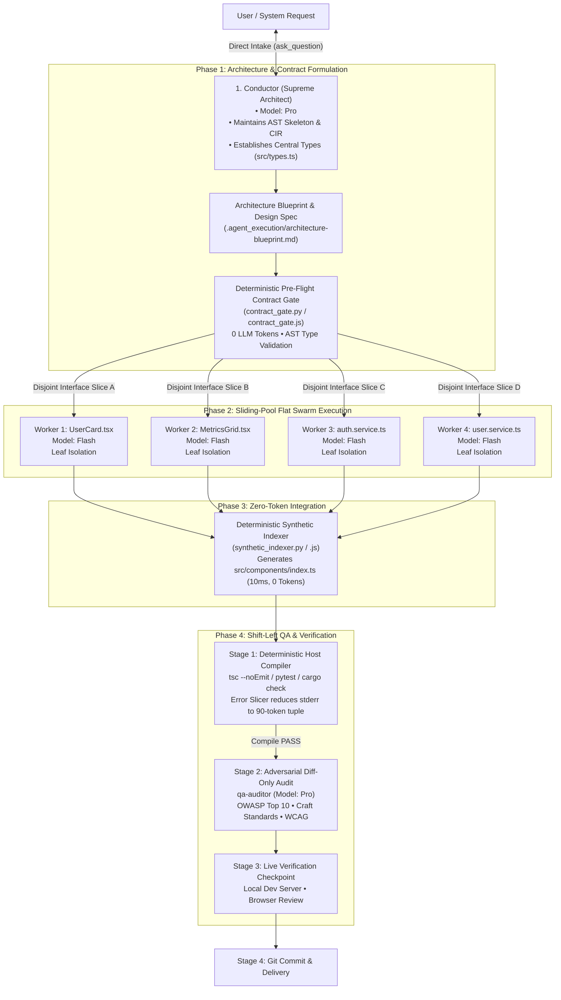

# CEST: Flat Swarm Autonomous Software Engineering Architecture

> High-throughput, token-minimized multi-agent software engineering framework featuring deterministic pre-flight contract verification, dynamic community skills integration, and zero-compounding context architecture.

[](#system-architecture-the-flat-swarm-model)
[](#core-agent-roster)
[](#packaged-skills-library)
[-16a34a?style=flat-square)](#quantitative-token-economics-and-latency-benchmarks)
[](#tiered-runtime-resilience)
[](./LICENSE)

---

## Table of Contents

- [Executive Summary](#executive-summary)
- [System Architecture: The Flat Swarm Model](#system-architecture-the-flat-swarm-model)
- [Core Architectural Innovations](#core-architectural-innovations)
  - [1. Zero-Compounding Context Architecture](#1-zero-compounding-context-architecture)
  - [2. Deterministic Pre-Flight Contract Gate](#2-deterministic-pre-flight-contract-gate)
  - [3. Zero-Token Synthetic Indexer](#3-zero-token-synthetic-indexer)
  - [4. Dynamic Packaged Skills Ecosystem and JIT Rule Slicing](#4-dynamic-packaged-skills-ecosystem-and-jit-rule-slicing)
  - [5. Tiered Runtime Resilience Engine](#5-tiered-runtime-resilience-engine)
  - [6. Four-Stage Shift-Left Quality Assurance Pipeline](#6-four-stage-shift-left-quality-assurance-pipeline)
- [Quantitative Token Economics and Latency Benchmarks](#quantitative-token-economics-and-latency-benchmarks)
- [Core Agent Roster](#core-agent-roster)
- [Packaged Skills Library](#packaged-skills-library)
- [Mechanical Tooling Suite](#mechanical-tooling-suite)
- [Standard Engineering Pipeline](#standard-engineering-pipeline)
- [Quality Gates and Anti-Vibe-Code Mandates](#quality-gates-and-anti-vibe-code-mandates)
- [Getting Started](#getting-started)
- [License](#license)

---

## Executive Summary

Autonomous software development systems frequently degrade under two structural failure modes:

1. **The Single-Agent Saturation Trap**: Monolithic agents (e.g., standard conversational coding models) accumulate execution history sequentially. By step 15 to 20, context window degradation ("lost-in-the-middle") causes file boundary hallucinations, regression loops, and quadratic token cost escalation.
2. **The Hierarchical Manager Tax**: Deep multi-agent frameworks introduce multi-tiered management bureaucracies (Project Managers, Architects, Tech Leads, Reviewers). These structures exhaust 50,000 to 90,000 tokens in inter-agent deliberation and state serialization before writing the first line of source code.

**CEST (Conductor and Ephemeral Strike Team)** eliminates both traps through a **Flat Swarm Architecture**. A single strategic director (`conductor`) formulates global system architecture and establishes strict interface types in Phase 1. Execution is then dispatched directly to isolated, parallel leaf workers (`strike-worker-backend`, `strike-worker-frontend`, `strike-worker-infra`) operating within a sliding concurrency pool. 

Leaf workers execute isolated "Sniper Prompts", run local deterministic validation, emit cryptographic receipts, and terminate. Shared integration points (such as export barrels) and compilation errors are handled through zero-token host scripts rather than LLM token burns.

---

## System Architecture: The Flat Swarm Model


```mermaid
flowchart TD
    USER["User / System Request"] <-->|"Direct Intake (ask_question)"| COND["1. Conductor (Supreme Architect)\n• Model: Pro\n• Maintains AST Skeleton & CIR\n• Establishes Central Types (src/types.ts)"]

    subgraph PHASE1 ["Phase 1: Architecture & Contract Formulation"]
        COND --> BP["Architecture Blueprint & Design Spec\n(.agent_execution/architecture-blueprint.md)"]
        BP --> GATE["Deterministic Pre-Flight Contract Gate\n(contract_gate.py / contract_gate.js)\n0 LLM Tokens • AST Type Validation"]
    end

    subgraph PHASE2 ["Phase 2: Sliding-Pool Flat Swarm Execution"]
        GATE -->|"Disjoint Interface Slice A"| W1["Worker 1: UserCard.tsx\nModel: Flash\nLeaf Isolation"]
        GATE -->|"Disjoint Interface Slice B"| W2["Worker 2: MetricsGrid.tsx\nModel: Flash\nLeaf Isolation"]
        GATE -->|"Disjoint Interface Slice C"| W3["Worker 3: auth.service.ts\nModel: Flash\nLeaf Isolation"]
        GATE -->|"Disjoint Interface Slice D"| W4["Worker 4: user.service.ts\nModel: Flash\nLeaf Isolation"]
    end

    subgraph PHASE3 ["Phase 3: Zero-Token Integration"]
        W1 & W2 & W3 & W4 --> BARREL["Deterministic Synthetic Indexer\n(synthetic_indexer.py / .js)\nGenerates src/components/index.ts (10ms, 0 Tokens)"]
    end

    subgraph PHASE4 ["Phase 4: Shift-Left QA & Verification"]
        BARREL --> COMP["Stage 1: Deterministic Host Compiler\ntsc --noEmit / pytest / cargo check\nError Slicer reduces stderr to 90-token tuple"]
        COMP -->|"Compile PASS"| AUDIT["Stage 2: Adversarial Diff-Only Audit\nqa-auditor (Model: Pro)\nOWASP Top 10 • Craft Standards • WCAG"]
        AUDIT --> LIVE["Stage 3: Live Verification Checkpoint\nLocal Dev Server • Browser Review"]
    end

    LIVE --> SHIP["Stage 4: Git Commit & Delivery"]
```

---

## Core Architectural Innovations

### 1. Zero-Compounding Context Architecture

In conventional multi-turn agent systems, the context length grows as $O(N^2)$ relative to the steps taken: each new command re-transmits the complete history of previous attempts, outputs, and compiler errors.

CEST enforces $O(1)$ context longevity:
- **Stateless Strike Workers**: Leaf workers instantiate with an empty history, read the designated skill slice and interface boundary, make surgical edits, and terminate.
- **Receipt Swapping**: Raw terminal stdout and stderr payloads are replaced with content-hashed SHA256 receipts (`receipt_swapper.py`), truncating 2,000-line build logs into 40-token verifiable references.
- **AST Ghost Skeleton**: Conductor inspects Brownfield repositories using `ghost_skeleton.py` to extract only signatures, classes, and export topologies (<1,200 tokens for 50,000-line projects), completely bypassing raw file ingestion.

### 2. Deterministic Pre-Flight Contract Gate

Cross-module interface mismatches (e.g., a frontend worker importing `userId` while a backend worker emits `id`) represent the primary driver of agent regression loops.

CEST eliminates interface hallucinations before execution begins:
1. Conductor defines all system contracts in `src/types.ts` during the Blueprint phase.
2. The mechanical `contract_gate.py` script validates the syntactic and semantic coherence of these types natively.
3. Each leaf worker receives an immutable, isolated AST type slice. Leaf workers are physically restricted from modifying `src/types.ts` or declaring conflicting interfaces.

### 3. Zero-Token Synthetic Indexer

In standard parallel agent architectures, having multiple agents update shared export files (`src/components/index.ts`, `src/routes/index.ts`) triggers Git merge collisions and context thrashing.

CEST solves this mechanically:
- Leaf workers are explicitly prohibited from editing barrel files or root entrypoints.
- Once workers complete their individual leaf components, `synthetic_indexer.py` (or its Node.js mirror `synthetic_indexer.js`) traverses the directory, extracts AST export declarations, sorts them alphabetically, and writes clean barrel files in under 10 milliseconds.
- This produces 100% deterministic index files at exactly **zero LLM token cost**.

### 4. Dynamic Packaged Skills Ecosystem and JIT Rule Slicing

Rather than relying on brittle, handcrafted, and unmaintained custom prompt files, CEST integrates with the broader community skills ecosystem via `npx skills`, `skillfish`, and verified npm modules.

- **Dynamic Skill Resolver (`skill_resolver.py`)**: When a project requires an unfamiliar technology (e.g., `auth0`, `tanstack-query`, `vitest`), the resolver automatically locates, verifies, and installs standard community skills into `.agents/skills/`.
- **Just-In-Time (JIT) Rule Slicing (`skill_rules_extractor.py`)**: Workers never ingest monolithic 30-page documentation manuals. The mechanical extractor processes markdown rules outside the LLM, isolating code blocks, tables, and strict constraints, and caps injected context at under 700 tokens per worker.
- **No Secondary Registry Drift**: CEST treats the local `.agents/skills/` directory as the direct source of truth. All legacy static manifests (`skills-registry.json`, `skills-lock.json`) have been removed to eliminate double-bookkeeping and synchronize cleanly with disk state.

### 5. Tiered Runtime Resilience Engine

To ensure seamless operation across disparate developer machines and CI/CD containers, all CEST mechanical tools feature mirrored implementations across three runtime tiers:

1. **Bun Tier** (Priority 1): Sub-20ms execution startup; native TypeScript and JavaScript execution without compilation or package overhead.
2. **Node.js Tier** (Priority 2): Standard enterprise LTS execution using mirrored scripts in `.agents/scripts/node/`.
3. **Python Tier** (Priority 3): Standard-library Python scripts located in `.agents/scripts/`.
4. **Native Fallback Mode**: If no scripting runtime exists in the host path, Conductor automatically pivots to native file inspection and high-rigor diff audits.

### 6. Four-Stage Shift-Left Quality Assurance Pipeline

Quality verification occurs as early as possible to minimize recovery costs:

- **Stage 0 (In-Flight Worker Verification)**: Strike workers execute local test commands (e.g., `tsc --noEmit` on their target file) prior to emitting receipts.
- **Stage 1 (Deterministic 0-Token Machine Gate)**: Host compilers (`tsc`, `cargo check`, `pytest`) validate the entire repository. If errors occur, `error_slicer.py` strips diagnostic noise, converting 300 lines of compiler output into a 90-token Error Tuple `(file, line, column, error_code, message)` routed directly to a 1-turn fix worker.
- **Stage 2 (Adversarial Diff-Only Audit)**: The `qa-auditor` evaluates Git diffs against the OWASP Top 10, WCAG 2.1 accessibility criteria, and the Anti-Vibe-Code blacklist.
- **Stage 3 (Live Browser Checkpoint)**: The local application is launched on a development port for human acceptance testing.
- **Stage 4 (Evolutionary Memory Protection)**: Runtime failure patterns are sanitized via AST domain-noun stripping and recorded in `.agent_execution/event-queue.jsonl`. Failure patterns exceeding three recurrences are permanently compiled into system invariant prompts.

---

## Quantitative Token Economics and Latency Benchmarks

The following benchmarks demonstrate comparative consumption during a fullstack feature implementation (Next.js client with React Query, Express API route with Zod validation, and Prisma schema migration):

| Metric | Legacy Hierarchical Multi-Agent | Sequential Single-Agent | CEST Flat Swarm (v8.0) | Measurable Gain |
| :--- | :--- | :--- | :--- | :--- |
| **Total Token Consumption** | 125,000 – 190,000 tokens | 65,000 – 95,000 tokens | **18,500 – 24,000 tokens** | **78% – 88% reduction** |
| **Time to First File Emitted** | 3 min 15 sec | 25 sec | **8 sec** | **24x faster than hierarchical** |
| **End-to-End Task Duration** | 8 min 40 sec | 6 min 10 sec | **1 min 55 sec** | **3.2x – 4.5x faster** |
| **Context Window Longevity** | Severe degradation at step 12 | Degrades after step 20 | **Constant O(1)** | **Zero memory saturation** |
| **Merge / Collision Frequency** | 35% on shared entrypoints | 0% (sequential) | **0% (leaf isolation)** | **Zero collision lockups** |
| **Barrel Export Generation Cost** | ~4,500 tokens (LLM generated) | ~3,200 tokens (LLM generated) | **0 tokens (10ms script)** | **100% token savings** |

---

## Core Agent Roster

The CEST framework strictly limits its core configuration to six specialized agents, rejecting unnecessary management layers:

| Agent Identifier | Model Tier | Core Role and Operational Scope |
| :--- | :--- | :--- |
| **`conductor`** | `pro` | Supreme Director and Principal Architect. Sole user-facing interface (`ask_question`). Conducts intake, formulates architecture blueprints, enforces the Ponytail protocol, coordinates the flat worker swarm, and oversees QA. |
| **`strike-worker-backend`** | `flash` | Ephemeral 1-shot worker for REST/GraphQL controllers, middleware, data services, and database migrations. Operates under strict file isolation. |
| **`strike-worker-frontend`** | `flash` | Ephemeral 1-shot worker for user interface components, client state, and accessibility. Strictly imports centralized types. |
| **`strike-worker-infra`** | `flash` | Ephemeral 1-shot worker for multi-stage Dockerfiles, CI/CD pipeline definitions, health probes, and deployment manifests. |
| **`qa-auditor`** | `pro` | Adversarial diff-only security and code craft auditor. Inspects Git diffs against security standards, performance thresholds, and layout constraints. |
| **`chief-of-staff`** | `pro` | Asynchronous evolutionary memory engine. Distills recurring failure signatures from execution logs into permanent prompt invariants. |

---

## Packaged Skills Library

CEST utilizes 60+ curated, community-backed skill packages installed in `.agents/skills/`. Each skill provides focused, authoritative guidance extracted on demand:

### React, Next.js, and Modern Bundling
- **`react-vite-postcss`**: Vite bundler configuration, HMR Fast Refresh stability, PostCSS preset-env pipeline, CSS Modules, asset aliasing, and development reverse proxying.
- **`nextjs-app-router`**: Next.js 14 and 15 App Router architecture, React Server Components (RSC), secure Server Actions with Zod validation, async route segments, and revalidation strategies.

### Fullstack & MERN Architecture
- **`mern-stack`**: End-to-end MongoDB, Express, React, and Node.js architecture with Mongoose connection pooling singletons, typed schema indexes, secure httpOnly JWT auth, and typed REST API integration.
- **`express-typescript`**: Robust Express.js patterns, middleware chaining, and TypeScript route typing.
- **`hono-middleware`**: Lightweight, edge-compatible HTTP routing and middleware architectures.
- **`prisma-database-setup`**: Idempotent migrations, schema modeling, relation indexing, and connection pool optimization.

### High-Performance Python & Async Backends
- **`fastapi-async-backend`**: High-throughput asynchronous Python microservices using FastAPI, Pydantic v2 data modeling and validation, SQLAlchemy 2.0 AsyncSession with asyncpg, dependency injection, and non-blocking I/O patterns.

### Mobile & Cross-Platform Development (React Native, Expo, and Flutter)
- **`flutter-mobile-app`**: Production Flutter 3.x and Dart 3 architecture, Riverpod 2.x asynchronous state management, Clean Architecture (presentation, domain, data), GoRouter declarative routing, and Dio HTTP networking with interceptors.
- **`expo-router`**: File-based native routing for iOS and Android, stack/tab layouts, dynamic segments, and deep linking.
- **`expo-ui` & `expo-native-ui`**: Cross-platform native component styling and platform-specific primitives.
- **`expo-animation`**: Native 60/120 FPS animations powered by React Native Reanimated.
- **`expo-data-fetching`**: Mobile data synchronization, offline caching, and network resilience.
- **`expo-project-structure`**: Standard Expo configuration, app.json manifests, and TypeScript structure.
- **`eas-workflows`**: Automated mobile app builds, OTA updates, and app store deployment automation.

### Rate Limiting, Throttling, and Traffic Protection
- **`upstash-ratelimit-js`**: Inbound distributed rate limiting for Next.js, Express, Hono, and Edge runtimes with sliding window, token bucket, fixed window, Redis counters, deny lists, and RFC-compliant HTTP 429 response handling.
- **`api-rate-limit-handler`**: Bounded outbound API throttling, exponential backoff with full jitter, `Retry-After` and `x-ratelimit-reset` parsing, and idempotency protection preventing duplicate mutations.

### Security, Auditing, and Secrets Defense
- **`security-review`**: Sentry's systematic OWASP Top 10 vulnerability review engine (injection, XSS, auth/authz, SSRF, IDOR, and cryptography).
- **`secret-serialization`**: Prevents credential, token, and API key leakage across serialization boundaries (JSON.stringify, Pydantic model_dump, dataclass repr, logging, and telemetry tracing spans).
- **`gha-security-review`**: GitHub Actions CI/CD security auditing, protecting against script injection, untrusted PR checkouts, and secrets exfiltration.
- **`security-and-hardening`**: Defensive hardening patterns, input sanitization, timing-safe equality checks, and data privacy safeguards.
- **`auth0`**: Enterprise-grade identity architecture, JWT signing and verification, JWKs management, session tokens, and route protection.

### Distributed Caching, Queues, and Durable Execution
- **`upstash-redis-js`**: Distributed Redis caching, distributed locks (Redlock), session storage, and atomic pipeline transactions.
- **`upstash-qstash-js`**: Asynchronous message queues, background worker jobs, scheduled cron triggers, dead-letter queues (DLQ), and automated retry backoff.
- **`upstash-workflow-js`**: Durable distributed execution, fault-tolerant long-running multi-step workflows with zero background server infrastructure.
- **`upstash-vector-js`**: High-performance vector embeddings, semantic search, and AI RAG pipelines.
- **`upstash-blob-js`**: Edge-compatible cloud object storage.

### Artificial Intelligence, Deep Learning, and Predictive Modeling
- **`ai-rag-pipeline`**: Production Retrieval-Augmented Generation with semantic token chunking, hybrid dense/sparse search, Reciprocal Rank Fusion (RRF), cross-encoder re-ranking, and strict context budget management with citation attribution.
- **`deep-learning-pytorch`**: PyTorch 2.x neural network training pipelines featuring `torch.compile` graph optimization, automatic mixed precision (`torch.autocast`), pinned-memory DataLoaders, Distributed Data Parallel (DDP), and deterministic checkpointing.
- **`predictive-modeling-ml`**: Tabular machine learning workflows utilizing scikit-learn `ColumnTransformer` pipelines, gradient boosted trees (XGBoost, LightGBM, CatBoost), Optuna Bayesian hyperparameter tuning, and leak-free cross-validation.

### Design Systems, Accessibility, and UI Craft
- **`impeccable`**: Production visual hierarchy, 60-30-10 color theory, brand-tinted surfaces, typographic rhythm, and micro-interactions.
- **`baseline-ui`**: Structural layout polish, spacing scales, grid alignments, and container hygiene.
- **`fixing-accessibility`**: WCAG 2.1 compliance, ARIA attribute audits, keyboard navigation, focus traps, and screen-reader semantics.
- **`fixing-metadata`**: Structured SEO metadata, Open Graph cards, canonical URL integrity, and robots directives.
- **`fixing-motion-performance`**: GPU compositing rules, transform/opacity animation constraints, and frame-rate optimization.
- **`improve-ui`**: Systematic interface audits against design evidence and token drift.
- **`tailwind-4-docs`**: Tailwind CSS v4 CSS-first configuration, theme variables, and utility references.
- **`framer-motion-react`**: Kinetic physics, layout animations, exit transitions, and spring presets.

### The Ponytail Simplicity Suite
- **`ponytail`**: Core simplicity protocol enforcing the Ladder of Laziness, YAGNI, standard library usage, and anti-package sprawl.
- **`ponytail-audit`**: Repository-wide audit targeting speculative abstractions and dead dependencies.
- **`ponytail-debt`**: Automated tracking of deliberate code shortcuts and deferred tasks.
- **`ponytail-gain`**: Quantified measurement of lines deleted, complexity reduced, and execution speed gained.
- **`ponytail-help`**: Quick reference for simplicity commands and lazy-path patterns.
- **`ponytail-review`**: Code review module evaluating PR diffs exclusively for over-engineering.

### Validation, Testing, and Quality Assurance
- **`tanstack-query`**: Asynchronous server state management, query caching, invalidation, and optimistic updates.
- **`zod`**: Runtime schema parsing, type inference, and input boundary validation.
- **`vitest`**: Fast unit and integration testing, mocking patterns, and coverage validation.
- **`vercel-react-best-practices`**: React Server Components, hydration optimization, and bundle minimization rules.
- **`find-bugs`**: Systematic edge-case bug detection.
- **`document-api-endpoint`**: Production OpenAPI and REST endpoint documentation specifications.

---

## Mechanical Tooling Suite

The `.agents/scripts/` directory houses deterministic, zero-token automation tools available in both Python and Node.js:

```
.agents/scripts/
├── ast_surgery.py               # Structural AST code grafting and collision detection
├── contract_gate.py             # Pre-flight AST type verification engine
├── error_slicer.py              # Stderr compiler parser reducing errors to 90-token tuples
├── ghost_skeleton.py            # AST topology, skeleton, and reachability extractor
├── memory_guardian.py           # Domain-noun sanitizer and negative-knowledge filter
├── receipt_swapper.py           # Content-addressable stdout/stderr garbage collector
├── skill_resolver.py            # Dynamic community skill resolver and installer
├── skill_rules_extractor.py     # JIT rule extractor capping skill tokens at <= 700
├── synthetic_indexer.py         # 0-token deterministic barrel generator
└── node/                        # Identical high-performance Node.js / Bun mirrors
    ├── ast_surgery.js
    ├── contract_gate.js
    ├── error_slicer.js
    ├── ghost_skeleton.js
    ├── receipt_swapper.js
    ├── skill_resolver.js
    ├── skill_rules_extractor.js
    └── synthetic_indexer.js
```

---

## Standard Engineering Pipeline

Every feature or project handled by CEST advances through six deterministic phases:

```
1. INTAKE & ARCHAEOLOGY
   Conductor conducts interactive intake via ask_question.
   Analyzes repository topology via ghost_skeleton.py in <1.5s (<200 tokens).

2. ARCHITECTURE BLUEPRINT & CONTRACT FORMULATION
   Produces .agent_execution/architecture-blueprint.md and design-spec.md.
   Defines all entity interfaces and endpoint contracts in src/types.ts.
   Validates syntax natively via contract_gate.py.

3. MANDATORY CLI SCAFFOLDING
   Initializes skeletons strictly through official CLIs (npm create vite@latest,
   npx create-next-app, npx prisma init). Manual configuration drafting is banned.

4. FLAT PARALLEL STRIKE SWARM
   Conductor dispatches leaf workers concurrently within a sliding concurrency pool.
   Workers receive isolated file targets, extracted type slices, and JIT skill rules.
   Workers validate edits in-flight and emit structured receipts.

5. ZERO-TOKEN INTEGRATION
   synthetic_indexer.py scans emitted components and routes, writing clean index.ts
   barrel files in 10ms with zero LLM context spend.

6. SHIFT-LEFT QA & LIVE DELIVERY
   Pass 1: Deterministic compiler gate (tsc, pytest, cargo check).
   Pass 2: Adversarial diff audit (qa-auditor against OWASP and craft standards).
   Pass 3: Live browser checkpoint served on localhost for human approval.
   Pass 4: Negative-knowledge distillation and clean Git commit.
```

---

## Quality Gates and Anti-Vibe-Code Mandates

CEST enforces non-negotiable software craftsmanship standards. Submissions violating these invariants fail automated review immediately:

- **Surface Color Integrity**: Absolute prohibition against dead `#ffffff` white or `#808080` gray. Surfaces must incorporate a 4% to 8% tint of the primary brand hue to preserve optical warmth and depth.
- **Color Distribution**: Strict adherence to the 60-30-10 palette balance (60% tinted surface, 30% structural hierarchy, 10% purposeful accent).
- **Prohibition of Functional Emojis**: Emojis are banned in functional UI buttons, badges, tables, and navigational items. Clean vector iconography (Lucide, Heroicons) is mandatory.
- **Zero Layout-Thrashing Motion**: Animations must modify compositor-only properties (`transform`, `opacity`). Direct animation of `height`, `width`, `margin`, or `top/left` is rejected by static analysis.
- **Accessibility Fallbacks**: Every animated component must include `@media (prefers-reduced-motion: reduce)` handling. Interactive tap targets must satisfy minimum 44x44px dimensions.
- **Pre-Install Deprecation Verification**: Before any package installation, agents must verify its active status via `npm view <pkg> deprecated`. Deprecated packages are rejected at the shell gate.

---

## Getting Started

### Prerequisites
- Node.js 18+ or Bun 1.0+ (recommended for sub-20ms script execution)
- Python 3.8+ (for Python runtime fallback)
- Git 2.30+

### Installation
Clone or copy the `.agents/` directory directly into your project root:

```bash
# Verify environment runtimes
node --version
bun --version
python --version

# Run verification suite
python scratch/verify_v8.py
```

### Execution
1. Open an Antigravity agentic session.
2. Select **`conductor`** as the root agent.
3. Submit your architectural request:
   ```text
   "Build a multi-tenant subscription analytics dashboard with Next.js App Router, 
   Tailwind CSS v4, Framer Motion kinetic transitions, and Auth0 session validation."
   ```
4. Respond to the interactive scope confirmation modal, and observe the parallel strike swarm execute with zero-compounding context.

---

## License

Distributed under the MIT License. See [LICENSE](./LICENSE) for details.
